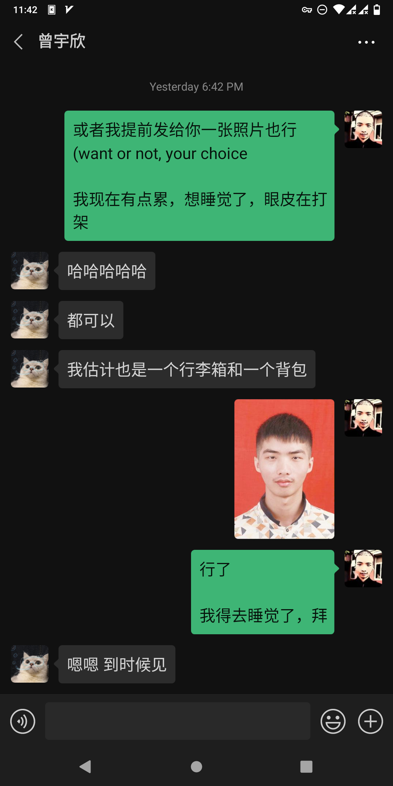
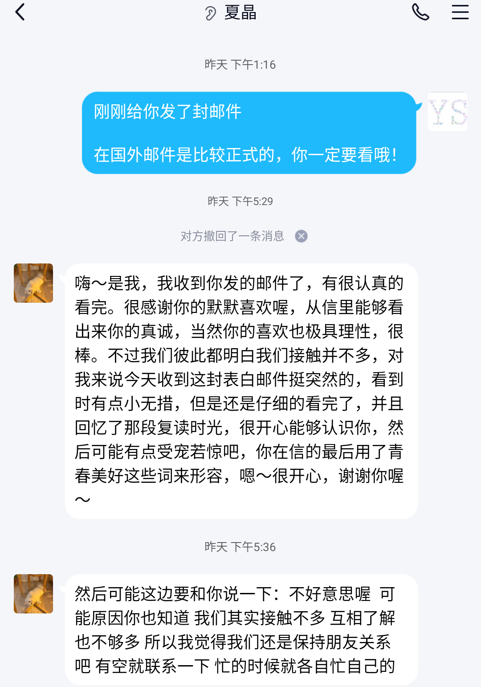

# 一封表白信

在看这封信之前，我必须得申明一件事： “我是个无趣的人，我每天做得最多的事，就是坐在电脑前，浏览着外网，写着无尽的代码。并且我从来没有谈过恋爱，也几乎没有女性朋友\(除了我妈\)。”

总体来讲，我是个不太成熟的人，没经历过社会，没承受过现实的苦难。我的世界观，如果不算求学经历，基本上建立在我看过的无数本书之上。

我喜欢你这件事，有好多重原因。让我们来仔细扒一扒，看看这究竟是为什么。

### **1. 一切都源于一个微笑、一声问候。**

我曾经给我一个好友讲过这么一段话，来描述这一个事件:

> 高中我回去考试的时候（我在家待了半年
>
> 所有人都对我爱搭不理的
>
> 就她记住了我的名字，还主动和我谈话

> 我一看
>
> 这么漂亮的妹子为啥对我这么好
>
> 当时就心动了

### 2. 人的思想与性格特征比外貌更重要。

心动并没有什么意义，我们看到外貌优良的人多半会心生爱慕，但这并不意味着一切。

没有人知道那副娇好的皮囊下隐藏着什么，真实情况可能会让人很失望。

我对你的观察早在三年前就开始了。

#### 问题一，什么样的人能一到大学就参加公益社团？

当然是善良的人。

#### 问题二，什么样的人说话能非常平静、有条不紊？

当然是有智慧的人。

#### 问题三，什么样的人会想着去台湾做交流生？

当然是热爱自由，喜欢冒险与新鲜事物的人。

最起码也是个有追求的人。

#### 问题四，什么样的人喜欢猫？

当然是那些喜欢安静，热爱独立自主的人。

#### 问题五，什么样的人能拥有上面所有特质？

1. 极端优秀的人。
2. 骗子，但是是有智慧的骗子。

综上所述，你知道我为什么喜欢你了吧? 

因为我环顾我朋友圈，发现没有一个人比你更合适、更优秀。\(也有可能是我女性朋友圈太小\)

### 3. 客观需要

人可以是孤独的。但人类这个整体不能一直保持孤独，不然将不会有下一代。

不管你承认与否，偶尔你还是想找个人说说话。

偶尔你还是希望有人能倾听你的心声、你的烦恼、你的哀伤、你的愉悦、你的欢乐。

### 4. 现实阻碍

我看问题，从来不看表面。我喜欢看一些深层次的东西。

当我准备向你发起进攻时，我忽然意识到一个严重的问题。

我们似乎很久没见面了。

这是个大问题。

这会让人产生严重的被害妄想症： 我会不会是坏人？我会不会只是想约炮？我会不会做出一些令人不愉快的事情？

当我脑子里充斥着这些问题的时候，我唯一能想到的解决方案就是： 咱们约在警察局吧！

当然这句话我始终没有说出口。

接着，不得不说你是一个十分聪明的女生。你没有拒绝，也没有明确的肯定。你只是保持沉默。

不要小看这个沉默，它能激起人们无限的幻想。

于是我的脑子又开始飞速地转起来。我开始分析双方的家庭背景，从各方面的证据，我推导出你家里可能是开酒店\(餐馆\)的。

我开始有点慌了，因为感觉我太寒酸了。约个会还得坐公交车。感觉我的人生受到了极大的侮辱。

我开始反思我的人生。

然后开始和老朋友谈心。

然后我哭了。

### 5. 机遇与挑战

可能现实确实和想象中的不太一样。

现实情况是，我极有可能在铁路上遇到一个“门当户对”的女铁路职工，然后就稀里糊涂的在一起了。

这不，才刚进工作群不久，就有一个女生因为我的言论太奇特，加上了我的微信，还和我约好了一起坐火车去报道:

### 6. The End, 这封信对你我的意义

**对我:** 再见了，我的青春以及相对美好的学生时代！

**对你:** I wish you have a good day by knowing that someone who admires and may love you for a quit good of times.

## 后记:

#### 女神的回复:

> 嗨～是我，我收到你发的邮件了，有很认真的看完。很感谢你的默默喜欢喔，从信里能够看出来你的真诚，当然你的喜欢也极具理性，很棒。不过我们彼此都明白我们接触并不多，对我来说今天收到这封表白邮件挺突然的，看到时有点小无措，但是还是仔细的看完了，并且回忆了那段复读时光，很开心能够认识你，然后可能有点受宠若惊吧，你在信的最后用了青春美好这些词来形容，嗯～很开心，谢谢你喔～

> 然后可能这边要和你说一下：不好意思喔 可能原因你也知道 我们其实接触不多 互相了解也不够多 所以我觉得我们还是保持朋友关系吧 有空就联系一下 忙的时候就各自忙自己的

 

#### 个人感受

没有出现互相拉黑的现象，这算是个良好的开始吧？

