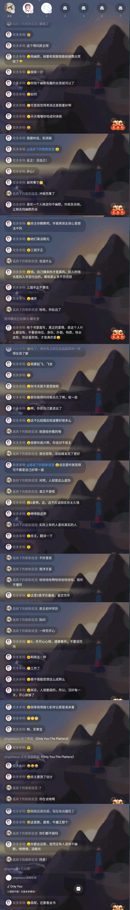
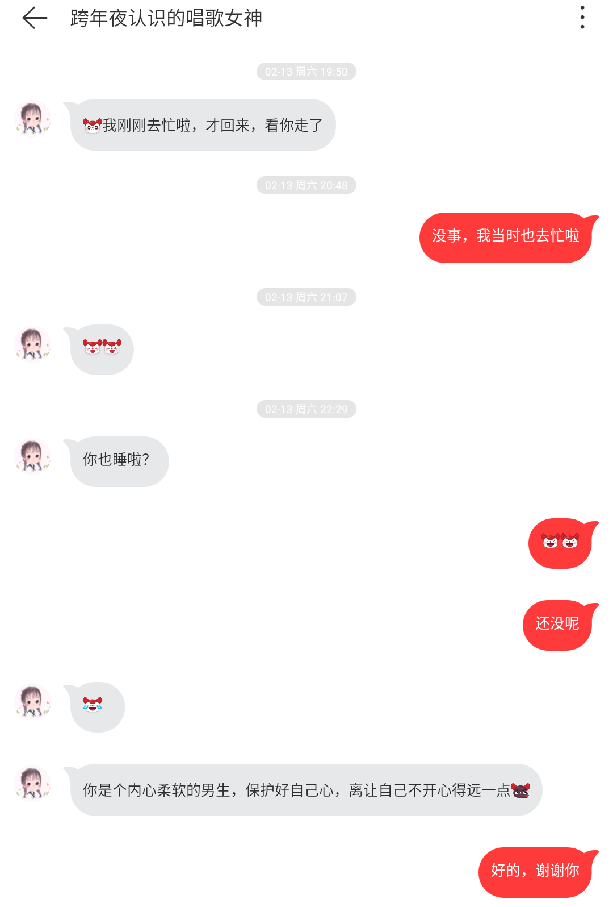
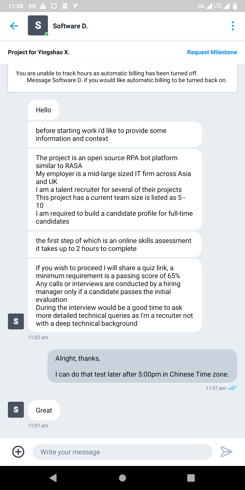
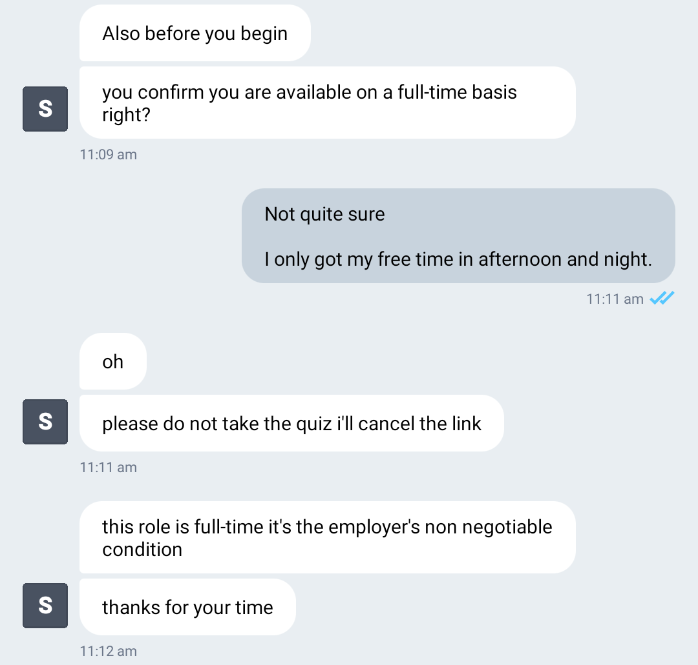
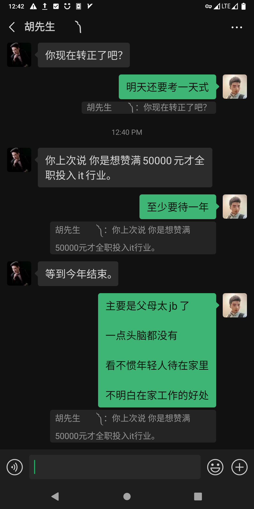

# 定职考试的准备及完结

## 先来点小考试探探你们的底

1月5、6号，职教科通知通信人员参加考试。

我们来到美涂宾馆住了一晚。实作在九龙坡实训基地完成。

这期间，我发现我能直视曾宇欣的眼睛了。这是一件好事。因为我可以大胆地欣赏她了。

并且，从某方面来讲，我可以用眼睛去传达一些东西了。比如传达爱意。\(传达你很漂亮、很优秀，我需要你之类的信息\)

另外，我发现曾宇欣也比较享受这个过程。她脸上的表情，这几天，由愤怒、到冷漠、再到幸福的笑容。

我感到了成就感。

但我仍不能松懈，我需要时刻保持警惕。一方面，我要在恰当的时机不经意间和她发生交互。另一方面，我还不能主动接近她。\(因为她会害怕，并且还会觉得受到打扰\)

最重要的是，在这一章，我的主要任务，是完成定职考试。

## 尘埃落定

事实证明，小曾还是选择了另一个男人。

不过这并不会影响到我的人生。

正相反，这会给我以极大的动力。

因为“喜欢的人已经变为人妻，只是因为自己没有出息”。

> 我会等她，另一方面，我也会全心全意地把心思放在工作上。期待再见的那天。

## 和老王的一次彻夜长谈 \(关于小曾\)

我为什么去找老王呢？ 主要是我觉得老王作为事件的参与者，应该会有感同身受。

事实证明我是正确的。作为放下了的那个人，老王确实可以给我很多开导。

我给老王讲了好多东西。老王也给我讲了关于我的好多东西。

最后老王和我都觉得我应该反思一下自己。

比如：

> 我自己也有错，我又不像追她的样子，我又想要结果…

又比如：

> 我追小曾，有三点重大失误:
>
> 1. 我都不敢直视她的眼睛、我都不敢和她讲话，这怎么能行呢？
> 2. 我和她文字交流的时候，太直接，什么话都往外说，一般人怎么能接受？
> 3. 实际上我也没有花太多的时间、精力和钱在她身上，女生希望看到更多实际的东西。

最终，我们都觉得应该找个机会当面道谦一下。老王说这是一个男人应该做的事情，我觉得随缘吧，有机会再表达。 

> 还有一个比较明显的失误，我给小曾留出了一个长达半个月的空窗期，这段时间我去写信去了。让她以为我没有追她了。

## 和老王的长谈2

我们在谈论时，还有一些其他的东西，比如。

曾宇欣确实是聪明。

* 上海前男友还没有分，这边就开始物色新男友了。
* 通信人员聚会时，KTV里各种喝酒划拳，说明其经常出入KTV、酒吧。
* 喜欢玩王者荣耀，说明其大学时期没少玩游戏。估计天天玩游戏，其次是逛街、吃东西\(从初见时的状态来看，应该是个吃货\(微胖\)\)
* 她能根据实际情况，对不同的男人展示不同的特性。\(这个真的很强大\)
* 她能根据实际情况，做出各种不同的行动，来实现其目标。

计划是这样的：

等我完成了我的目标，我会再花3天时间在曾宇欣身上。三天之后，要还没有结果，我就永远放弃这个想法。

## 再回忆

小曾是有恋爱经验的，不然不会知道各种各样的搞暧昧的方式。

她现在的男朋友也是有恋爱经验的，不然不会知道按照宾馆房间号送“阿迪达斯冰淇淋”。

## 3天绿皮火车乘务员跟班实训经验总结

当绿皮火车乘务员 绝对是一件让人堕落的工作

什么事都不能做，发呆，绝对是一件让你的智力返回原始时代最好的方法

另外，当乘务员唯一的好处就是，可以和很多单身漂亮的大学妹妹聊天: 我个人的原则是，充分的4目对视，诱发荷尔蒙，而后愉快地聊天。但绝不添加联系方式，因为我既不想花时间也不想花金钱在女人身上，但我又想要结果。

> 总结一点: 简单的机械性重复劳动是一定会被淘汰的。\(人不如机器\)

附赠和小妹妹聊天总结的经验:

1. 女生不喜欢控制欲强的男生
2. 女生拒绝别人的行为是保持沉默
3. 不要选择非单身的聊天对象
4. 不要在一列车和两个女生聊天（不能让其中一个听到

## 再谈恋爱观

谈恋爱是一件浪费时间和生命的事情

这件事在历史上发生过无数次

这只是大自然的骗局

驱使你交配

> 我现在知道为什么 有钱人 喜欢找学生妹了
>
> 一方面是年轻貌美
>
> 另一方面是纯洁，没有受过太多金钱、权力的污染，思想比较单纯
>
> 这些富豪年轻的时候没有好好的谈过恋爱，都去学习和赚钱了，所以后来老了就想体验年轻的感觉

曾宇欣是情场高手

我在火车上搭讪、玩暧昧却 不加微信或其他联系方式

实际上就是想增加自己的经验，同时体会曾宇欣的感受

## 不再伪装

曾宇欣终于对我放弃了伪装。

她就是一个“游戏王”+“麻将王”+“心机girl”+“酒王”+“划拳王”+“餐桌小姐”。

> 原来小曾和其他所有人一样，一样的平庸。
>
> 她和其他所有人一样\(热爱浪费时间、热爱打麻将\)，唯一不同的地方在于之前她之前为了我，隐藏了一段时间她自己的本性。
>
> 不过她也有一些破绽，但我没有意识到。比如，当小魏讲自己喜欢打麻将时，她举手支持了她。

## 总结

找对象还是要多接触，才能了解对方的生活习惯、作风。从而作出一个比较合理的决定。

## 小曾的世界

据我估计，她至少经历了4个男朋友。

1. 每个男人的餐桌她都去。
2. 性欲旺盛。\(在还没有和前男友分手的时候，便开始物色新男友了。说明很需要这个。\)
3. 那种对男人的把控，没有经验是学不会的。
4. 九龙坡实训时，故意把身子倾斜靠近我。也说明经验丰富，且性欲旺盛。

## 小曾的世界2

今天我要讲第二个故事。

小曾的前男友是个上海人。上海人有个特点。那就是有钱。

所以贪图物质享受的习惯就是在那个时候养成的。

> 所以她的本质就是个混世魔王，花天酒地、灯红酒绿是她的最爱。

而且在上海这个人际关系极具复杂的地方，那低龄的智商，别的没学会，伪装得“道貌岸然”、实则内心“腐坏”这一套，倒是扎扎实实的学会了。

而其表现出来的“聪明”，也就是所谓的“心机”，这是从哪儿得来的呢？宫斗小说。\(描写皇帝的妃子间互相斗争的小说\)

其真实的文化水平，只需要看她实时回应你的东西就行了。

> 推论2

> 如果你不断向对方发送高级别话语，而对方只是回一些低端答语
>
> 只有两种情况：
>
> 1. 对方对你不感兴趣
> 2. 对方文化层次较低，没办法回答你，一答就暴露她的智商

## 小曾的世界3

由其还未和上海前男友分手就开始物色新男友这一点看。

她谈过绝对不止一个男友。\(第一次失恋，按理来说应该十分痛苦\)

## 理论考试结束

考试就发了两张原题卷子。

然后我们搞了一份缩印小抄，我没有背大题，全都是抄的。

## 回家过年吗? 小胡？

回家？不存在的。

为了个人理想的实现，怎么能回归那世俗的生活？

我必须要在一个人的孤寂中，寻找到属于自己的那一条独特的道路。

## 道路

我发现成人世界具有极大的振荡性。

他们一会儿做这件事，一会儿又做那件事，然而所有的事情都没有用到多少脑子。

属于简单的机械性重复。这种重复不会使他们的某种技能得到提高，相反，各种各样的事情在分散他们的精力。

## 关于我为什么不回家过年的重复声明

不回家过年，是为了以后天天在家“过年”。

只有先把自身能力提升到位了，钱挣到位了，才有选择权。\(我想在哪儿工作，就在哪儿工作\)

> 现在父母的身体还硬朗，回去没有必要。等他们以后动不了了，回去才有必要。

## 除夕夜在网易云K歌房遇到的歌唱女神

这个女生，声音很甜、很嫩、很好听。说话也沉稳，随时随地透露出一种乐观积极的心态，语气之中总能让人感到快乐。

总结几点她讲的：

1. 活出自己
2. 三观不正的不要找，钱自己赚来的才是真的，哪有那么多不劳而获
3. 等你考上研究生，周围基本上就是和你一样的女孩了
4. 真正的爱情，是这个人什么都没有，你只看他个人的品质、学识，你还喜欢他

就是这个女生让我感受到了，人间还是有善意的。

\(据个人观察，我觉得她应该是中文系研究生，同时生活富裕，不愁吃喝\(思想非常纯净，底层人是没办法做到这一点的\)；不仅会唱歌，还会弹吉他。\)

\(思维严谨\(从谈话得出\)，生活作风规矩\(歌单的分类做得非常好\)，追求高雅\(和我一样，歌单里面几百首英文歌...\)\)

## 感觉错过了一个亿

今天，freelancer网站有个人雇用了我，说可以有3个月的remote job，关于写代码，5美元一小时起步，40小时一周。

结果聊着聊着，我说我不能全天工作。所以他就把我拒绝了。

我感觉挺好的，在家就能挣6000+一个月的钱。

## 记一次与职场女长辈的聊天

她叫向静，是九龙坡的一个分管职教的技术工程师。

她: 我以前一个同事说她儿子进铁路需要考了

我: 真正厉害的人是不怕考试的。再说了，就算是考试，谁出题，谁就漏题。最后还是铁路体制内的人受益。

我: 另外，学校那些学生，本身就是学这个专业的。作弊都成习惯了，他们会怕这个？

她: 就是担心过不了这关。

我: 过不了倒也是一件好事。对这一行不热爱，还不如早点走人。在自己不热爱的行业是没办法做成一番事业的。

她: 家长肯定觉得铁路比较稳定，所以还是希望孩子进来吧。

我: 家长限制了孩子的发展。他们从来不考虑，或者没有考虑过孩子的感受。当然，孩子无能+无志向，则另当别论。

她: 很多孩子应该都属于后者。

我: 事实当然是这样。那些意志力极度坚强的人毕竟是少数。但更多时候，从我个人的生活经验看。是父母的智力、眼界、世界观太狭隘，没办法看到他们孩子的闪光点，也没办法看到一条较少人走过的可以通往成功的、竞争相对较小的路。

她: 你与其它孩子不一样\[ThumbsUp\]。

我: 过奖了。

我: 稳定本身就是个伪命题。别人一次挣几十万，接着可能一两年都不挣钱。表面上他什么也没做，实际上在酝酿下一款产品。别人挣的是长期利益。另外，像开公司，做投资这种有风险的挣钱方式。估计那些工薪阶层一辈子都不会理解，也不会推荐，也不会涉及。所以他们一辈子都是打工人。

她: 意识和观点不一样。

## 赚钱新思路

小商贩思维总结: 我不生产产品，我倒卖产品。

我做了一个观察: 淘宝上同样一本电子书，一个卖9元，一个卖4元。（我们也许可以卖9元，买4元，赚差价

我的思考: 我自己觉得，除了搞一个机器人外，还可以搞一个 下线，人工操作一些东西。比如对我来说，我妈在家就没工作，就可以当个客服…

我的计划: 我觉得就应该先从卖书开始，教我妈做倒卖生意，这个便宜。

我的目的: 像我妈这种女人，一两块钱就能让她高兴半天。就是应该让她尝到在家赚钱的甜头，不然没办法转变她的思想。

总结：

> 1. 哪些店铺？ 淘宝、闲鱼均可，但优先闲鱼。（因为这个平台我妈已经会了
> 2. 我们没有产品，我们空手套白狼。（淘宝搜索，电子书代找，你就懂了
> 3. 我们是投资人，我们是管理人员，我们是领导。我们不干苦力，我们让别人干活，我们只出脑子。（再说你我都没有时间做这个
> 4. 这只是个实验。如果连我妈都能赚钱。那我们就可以发展血亲下线，帮助他们脱离血汗工厂。

后记：

我们并没有付诸实践。因为我们知道像我们父母这样的底层人，只需要让她们失败一次，就会轻易放弃自己的追求。而我们不一样，无论我们失败多少次，都会站起来再试一次。

我们应该先至少试出一条成功的路，再转交给我们的父母。

## 得到父母的支持

### 起因: 

经过日日夜夜反复的思考，又受到美元的打击\(别人要full-time，我却只能do part-time\)

### 造势: 

#### 1

#### 2

我觉得家庭条件好，真的是成功的一个重要因素

就算父母没有钱，敢放手让孩子去干、去闯，也比管这管那儿，教育孩子当缩头乌龟强

#### 3

不一定是5美元每小时

那只是我自己标的价

一般外国人觉得最低也得10美元一小时，也就是1万多人民币一个月

#### 4

最重要的是在家工作

同志们！在家工作！

每天6小时，结束后想干什么干什么！

教孩子？没问题。 干老婆？没问题。 做生意？没问题。 继续学习？没问题。

一切困难，在可自由支配的时间之下，都变得不是问题

#### 5

还有一个没问题

照顾双双失去行动能力，生活不能自理的父母?

没问题

不然就只能任父母自生自灭

### 反驳

我妈答道：

关建是不是长久的？天天有\(工作\)做？

> 个人点评: 这里就有点打工人的味道了。愿意天天干苦力。

### 我的智慧

#### 1

稳定本身就是个伪命题

别人一次挣几十万，接着可能一两年都不挣钱

表面上他什么也没做，实际上在酝酿下一款产品

别人挣的是长期利益。

另外，像开公司，做投资这种有风险的挣钱方式。估计那些工薪阶层一辈子都不会理解，也不会推荐，也不会涉及。所以他们一辈子都是打工人。

#### 2

它这个项目3个月

3个月以后，你又可以接其他项目

#### 3

最重要的是人脉的积累

做成一单生意，下一单别人又会想到你

而且单子越来越多，因为你信誉越来越好

#### 4, 致命一击

傻逼们是永远不愿意跳出他们现有的圈子的

这就是为什么他们会永远当傻逼

### 妥协

我妈回答道：

是这个道理。

你已成年，要干什么工作，你自己决定，我们管不了。

### 我的暗示

好

那我就先干一年，在铁路上挣5万块钱

然后用这笔钱做房租

一年后开始我的新生活

### 再次妥协

我妈: 家里有房子

### 我的目的已经达到

#### 1

要的就是这句话

这样能极大的增大我成功的概率。

但现在还不急，我得看看我能不能在这一年，边在铁路工作边保持学习

要是我坚持下来了，事情将变得更好！

#### 2

这个决定有多方面的原因:

1. 要是我待一年，还是想走，说明我真不想干那玩意儿
2. 如果我坚持学习了一年，那说明我确实有能力也有毅力干我想干的事情（并且我又学了不少东西（比如考研的知识
3. 由于我和那些人格格不入，强烈的隔绝感和逃离感会驱使我更加努力的学习和工作
4. 总有一天，会有一个导火索、会有压死骆驼的最后一根稻草，让我坦率直接的离开铁路系统

### Happy ending

我妈: 反正自己合理安排。实在不行，就去干自己喜欢干的事情。一旦开始，就要坚持下去，不要往复。

> 点评: 从这一句话，可以看出，底层人的思维的确很low。喜欢的事情难道不该勇敢去做吗？我就没见过哪个伟大的人做自己不喜欢的事情能成功的。

我妈: 我承认，写代码确实也能成功。这和学历没有太大的关系。

## 实作考试结束

4个设备。每个设备2个故障。考2天。

说是随机考，在设备里选一个故障。实际上，上午考一个故障，下午考一个故障。题目在半天的时间内都是固定的。

只要你在名单里的顺序靠后，你就一定能有足够的时间记忆，并通过考试。

总体来讲，我觉得一个会背书的小学生都比我们厉害。。。\(或者，小学生都能通过这考试

## 实做考试被摆一道

先是说能过就行，后来他们依靠这个成绩选择工作地点。

实际上这东西是有征兆的。

如果是不重要的考试，上面不会在考试当天专门跑过来检查。

> 生活的经验真的很重要。

于是，就这么着，我将前往一个他们十分害怕的地方: 涪陵。

但实际上，有网、有电、有水、有快递，不知道他们在害怕什么。

我唯一需要注意的地方，就是: **一定要住单人间**。\(要不然就得天天睡派班室\)

