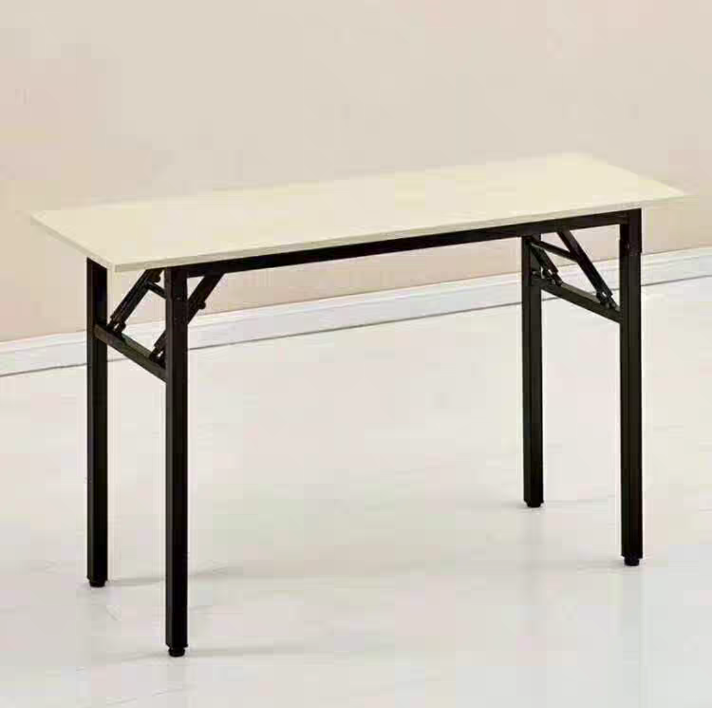
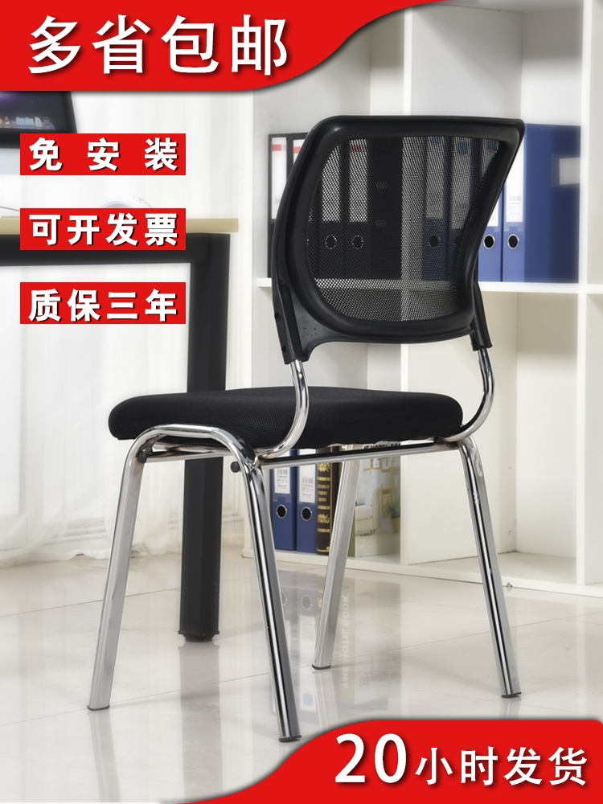

# 生活上

## 1. 独立的房间

一定要有个不受人打扰的地方。

这里有电、有网、有独立卫生间。

## 2. 足够长的桌子

这个就用一般的单层折叠桌就好了。

长1.2以上，宽0.6以上，高0.75。

## 2. 人体工程学椅子

这个椅子需要和桌子搭配，以能深入桌子底部为最好。

`没有滑轮`有利于稳固写代码的姿势和心情。

## 3. 睡袋

这个主要是为了方便你穿着衣服睡觉。

并且你可以随时出去睡。

并且你不需要叠被子。

