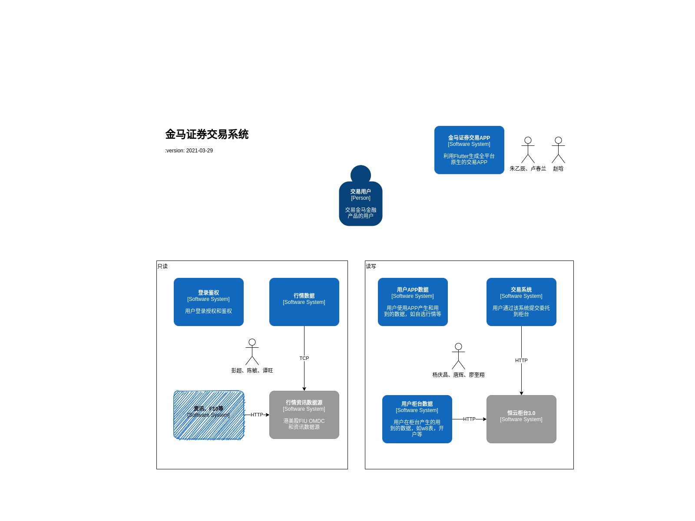
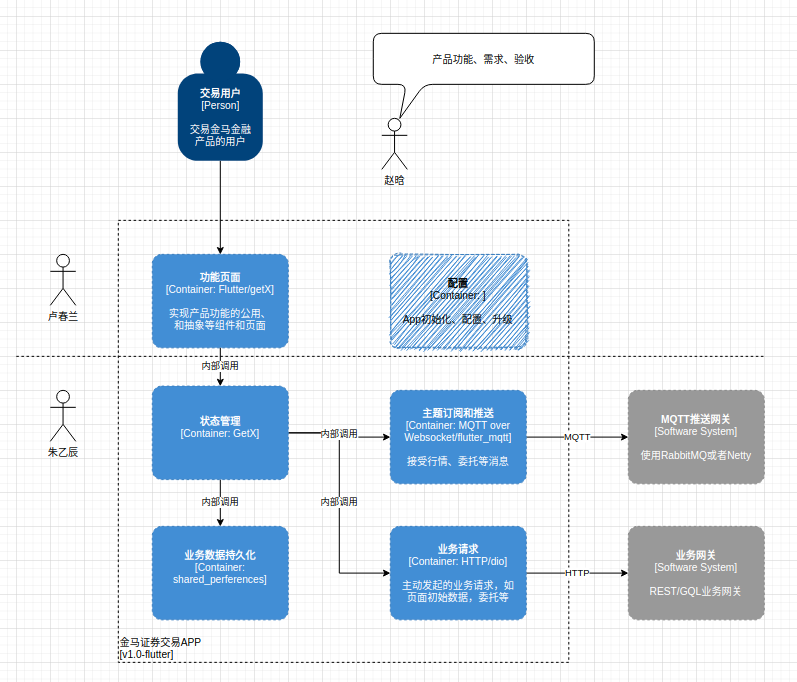
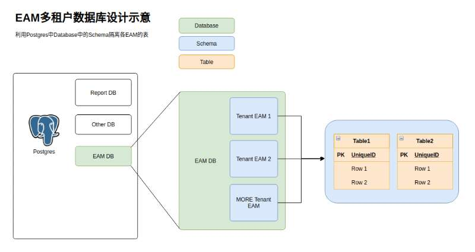

# 华港咨询有限公司

## IT director 寄语

> Hi，英杰，系统的设计和开发工作，很多时候需要花时间在业务的理解和思考上，写代码是最终想法的实现；平常工作里面，与人交流配合工作，也是一样，大家配合好了，可以事半功倍。 
>
> 你算是新人，多思考，多做，在融入团队和沟通交流上，向辉哥学习学习，希望你能全面发展！

我的回答:

> 是的
>
> 昌哥
>
> 新人肯定要拿出新人的样子
>
> 多思考多学习
>
> 至于团队与沟通交流嘛，谁优秀，我跟谁学（既然昌哥说辉哥优秀，那就跟辉哥学

我的感想: 

> 大家都会写代码
>
> 但不是所有人都会构建业务
>
> 对系统的整体构建的能力才是程序员能够从公司里面学到的东西（这很重要
>
> 另外，与人相处的能力，学会了，去哪儿都有好处

## 来做个分析，以现有信息规划未来

### 公司产品设计图

### 我个人的计划表

1. 3号早上坐高铁到深圳
2. 住上青年旅馆\(太空舱\)
3. 5号体检
4. 6号报道

## 入职成功

新工作地点的豪华程度超乎我的想象。

似乎我这辈子没有进过这么好的地方。

超级大厦、豪华大厅、豪华电梯、豪华写字楼、豪华厕所、全自动化的门禁系统、新办公室、超快的电脑。。。

一切的一切，都让我更加坚定的想要完成工作任务，并且留在这个地方。

## 昌哥很欣赏我啊

### 1

后面除了flutter部分，你去帮一下乙辰，有几个方向的工作还没正式展开： 

1. Gitlab CI/CD 

2. Airflow 任务调度 

3. ETL 和报表分析

### 2

前面几个月，你各个业务都熟悉一遍，轮流接触下。 

PMO，流程设计，App前端，交易接口，React前端等。 

积累好业务背景知识，工程和协作配合能力。

之后由你挑一个你喜欢的方向，我挑一个你不太擅长的方向，作为你接下来1年内的工作重点。

给你规划一下，让你有个工作的进入过程。We treat you as `Management Trainee`.

## 看过公司培训视频后的感想

这老板\(CEO 孙越君\)，还是很聪明，也很有动力的。

不愧为可以创立公司的人。

他的理论我都比较认同，而且他也喜欢硅谷风格的创业方式。

总体来讲，他就是要创立一个`跨国科技金融公司`。

## 一个月过去了

我感觉程序员的生活真是太爽了。尤其是对于我来说。反正我每天也没有其他的事情需要做，能写代码，又能有钱赚，有什么不好呢？

主要是工作环境有了翻天覆地的变化。我现在的工作环境，干净整洁，科技感十足且简洁方便。

身边人也都是有文化的人。相比起铁路上那些，说三句话必带一个脏字的人来说，好太多了。

工资也不算低。一个月到手8000，主要是房租和生活费贵，一个月得1000+1500=2500。

