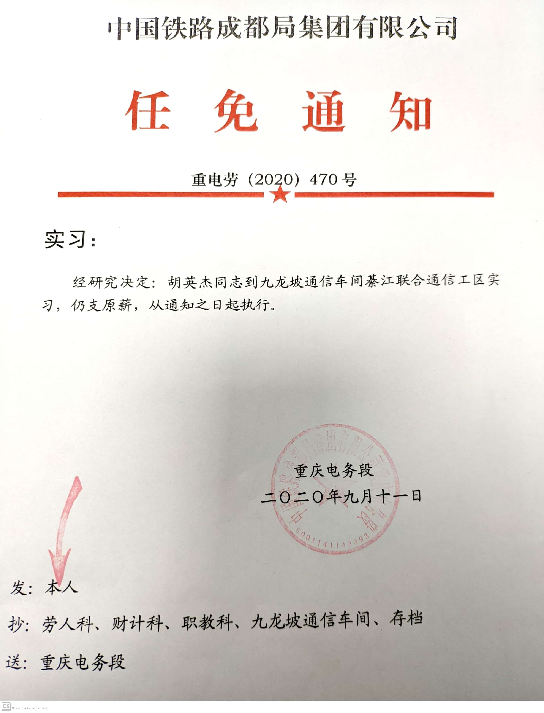

# 来吧，九龙坡通信车间綦江联合通信工区

## 情况说明

我告诉你，我被调到了“九龙坡通信车间綦江联合通信工区”。

这里一切都好，有外卖、快递、WiFi、开水机、热水淋浴、洗衣机、空调。

有图为证：

## 工作事宜

上午9点钟开始，整个上午，就算没有事情可做，也必须待在派班室。

下午，若无事，可自由安排活动。

## 学习方法

做资源统计，该工区管辖范围内有哪些设备，分别有什么作用。该工区管辖范围内有多少光纤或光缆。

在统计的过程中，就顺便学习了该学习的东西。以为“维护工作”的本质就是维护设备和线路。

