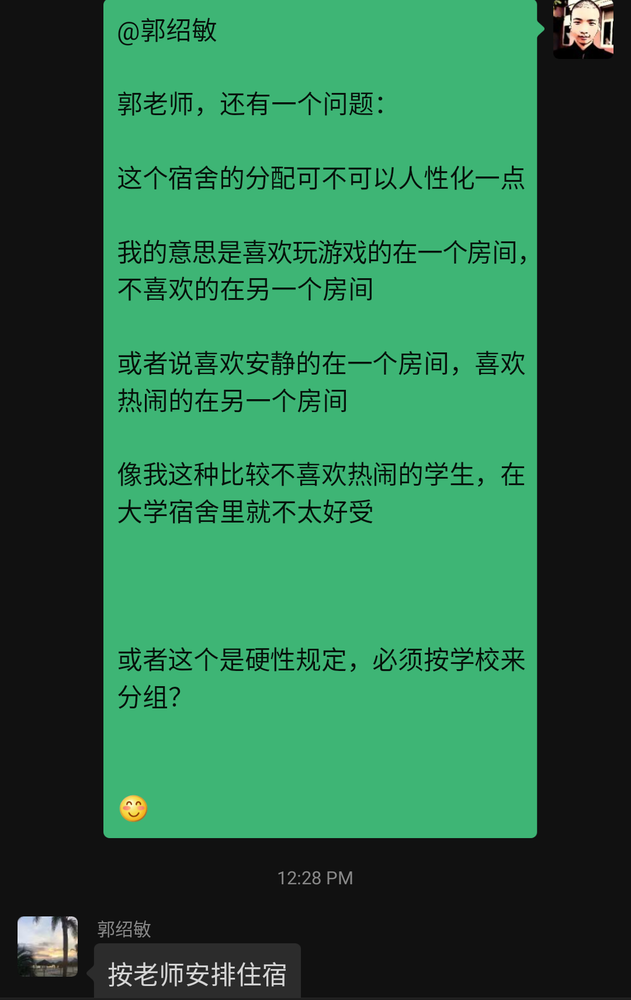

# 入职重庆电务段

## 在去报道之前

### 给“女朋友”的话

不知道会不会有趣。但有一点是肯定的，应该不会太美好。

所以我给我心仪的对象发了如下一段话

> 首先，谈谈这个工作
>
> 用老人的话来讲就是饿不死。
>
> 然后，工作环境，
>
> 从物理上讲，我估计一线工人想坐办公室肯定是不行的，除非守主机机房\(但这应该是女生的工作，应该和我没关系\)
>
> 从人上讲，我很担心这一点，因为我爸也是铁路工人，他的文化层次我是很清楚的，基本上属于文盲，小学文化、大老粗、抽烟、日常无意识飙脏话等。
>
> 另外，我的大学同学也都，不是去地铁，就是去国铁。他们的级别我也都清楚，毫不留情地讲，都是垃圾，干啥啥不行。但他们还偏偏都能被单位招进去…
>
> 最重要的一点是，他们素质低一般情况下和我没啥关系。但是一旦我住进了集体宿舍\(单身职工宿舍之类的\)，就和我有关系了。我一回想大学时被室友的噪音折磨得睡不着觉的感觉，就心有余悸。不能自己租个房间，和别人群居真是太痛苦了，想干什么都不行，有极大的束缚。
>
> 恩，重点就是想办法单独住一个房间，租房子也好，买房子也罢。至少在所谓的“新员工培训期”之后，我要把这件事给完成掉。

由上面的文字你可以看出，我很讨厌不安静的环境。

### 发了一条空间说说

可以说是随心而发吧：

> 虽然很难承认
>
> 但我们这一代人大多都是loser，无关性别
>
> 因为我们没办法独立生活
>
> 离开了父母，连单间房子都没得住（说到这儿，不经佩服起那些有勇气搬出去住独立房间的年轻人

### 跟老爸吵了一架

为了这个问题，我还和我爸爸吵了一架。

主要围绕：

1. 我认为宿舍就是不应该太吵，空间是共有的，凭什么你要打扰别人的休息？我爸不认同，他认为别人都可以忍受，为什么我忍受不了。而我认为别人都是垃圾，回到宿舍只知道打游戏、刷短视频，一起娱乐当然不会觉得吵。而我就不一样了，我喜欢业余时间看书、写代码，安静地带上耳机听歌或者看电影、美剧等。
2. 我认为等培训结束后，我就应该搬出去，自己租一个房子住。我爸还是反对。反对理由同上，甚至还直呼我是“神经病”、“脑子有问题”。我就反驳道：“追求自由有错吗？”、“追求更好有错吗？”、“追求安静的生活环境有错吗？”、“追求个人空间有错吗？”

### 和一个老朋友聊了下天

有图为证：

大意就是如果我去做软件开发，会很成功。

这是我第一次意识到自己的人生很失败：

> 我的理智在不断的告诉我，我就是个傻子，不断地在人生的关键时刻做出错误的决定。

### 表白以及学到的东西

我写了一封表白信。

发现其实际效果并不太好。

总体来讲只能起个画龙点睛的作用： 若是对方本来就对你感兴趣，可以。要是没有，就是个简单的娱乐。

1. 成人世界的法则是真的: "沉默是拒绝的代名词。"
2. 批评人最好不要一次全盘脱出，隔好长一段时间说一次，最好不说。就算说也要谨慎，小骂大帮忙那种。
3. 说话少不一定比说话多效果好。“言简意赅”比“_啰哩啰嗦_”效果更好，对于现代人来讲。

## 去报道的时候

### 多个伴

原本打算一个人走的。结果因为我在群里发了一系列的文字。一位同在工作群的女生觉得我比较有智慧。所以主动加了我。结果一问才知道，大家都是广安人。而且父亲也都是在工作单位认识。

有图为证：

然后我和她就顺理成章地约定好，一起坐火车。

实际上，在车站第一眼见到她还是很惊喜的。毕竟，在家里待7、8个月都没见过活人，女的。

而且她的装束也非常的现代与考究。更重要的是她的仪容仪表让人觉得眼前一亮。在戴着口罩的情况下更显得非常的完美。至于身高，我从来不看这个。\(或者说和我妈差不多高对我来说就不错了，我妈150+\)

接着我们因为火车晚点，临时蹭了一列火车。由于在这列火车上没有我们的座位，所以我们需要靠很近，站1个多小时才能到达目的地。

在这一个小时里，我们当然可以讲很多的话，从家庭背景到世界观。我很享受这个过程。不仅仅是因为我几乎没和年轻的女性这样谈过话。更因为我感觉我是在和一个有智慧且诚实的女性谈话。

然后我们去乘坐公交。感觉挺新鲜的。因为我从来没坐过重庆的公交。行李箱必须得单独放在后备箱里。

在公交车上，在惬意的空调风吹拂下，我们接着谈话。这一次我们更坦诚了，谈的东西也更多了。从学业经验到人生理想。

我甚至隐隐觉得我好像之前认识她。我们一样优秀。

随着信息的交换越来越多，我们惊讶地发现，我们两个竟然是小学同学。虽然只有一年级。但这也足够说明一件事情，我们真的很有缘。

### 来吧，偏僻的地方

接着，历经千辛万苦的我们。终于到了“重庆电务段实训基地”。

不得不说，这里真是有够偏的。道路两旁有肉眼可见的垃圾、到处破破烂烂的。

还有蚊子，我刚到时还被咬了。

## 报道之后

### 幻想与现实

住房条件方面，男生统一6人间，两个空调，被子枕头都是现成的。有热水淋浴。唯一的缺点就是男女共用澡堂、洗衣台。一旦规定晚上7-10点只能女生用，男生要洗澡就不方便了。因为没有灯\(Yes, this is ridiculous\)。

室友方面，暂时不吵。但是在室内抽烟这个事情还是很烦。\(可抽烟不影响体检，这也是挺奇怪的。\)

### 免费的一切

这个是真的很不错。水电全免，包吃包住。最重要的是在这里学习一个半月还能有工资。 

### 我该怎么做？

那个女生处在矛盾中，一方面是之前与我有关的美好回忆，另一方面是得面对我在现实中不太善于与人交际这个事实。

我也处于矛盾中，我到底该做什么？一方面，我拿着我之前从2T硬盘拷贝下来的7000本书，幻想着能从中寻找到一些有用的处事哲学与具体方法。另一方面，我还得思考我在现实中需要做的每一步。比如看见陌生人要微笑。看见熟人得打招呼。吃饭的时候，我到底是和“她”一起坐，还是随便找个角落坐下。上课的时候，我到底是和“她”一起坐，还是随便找个角落坐下。今天到底要不要给“她”发微信，发多少条？发什么？

另外，看到“她”每一次扳椅子远离我的时候，我都有点伤心。我自己都在怀疑我应不应该靠近“她”。或者这一切都是一个简单的win-win阴谋论： 我在众人面前表现出追她的感觉。这样在全班男生、女生的心目中，她的地位就提高了。而我，会由于太专情，而得不到回应，被某个看不惯的女生倒追。

诶，成人的世界真是复杂。

## 曲折的体检路

### 第一次体检

这次的体检发生在“重庆市疾病控制中心”。原本让我担心的腰的问题，实际上不是个问题。因为他们根本不查X光。

但另一件奇怪的事情发生了。我听力没有过。有图为证:

而且听力受损的部分很奇怪。

### 第二次复查

在同样的地方，但是只查听力。结果仍然不过。

### 准备离开

鉴于这种情况，我只能开始另外打算我的前途。

我做的第一件事情就是去把我无法进铁路局的事情告诉我的编程朋友们。

然后向他们询问经验。比如如何选择城市，如何找开发工作，如何租房子之类的事情。

每次我做这个事情都非常地感动。因为我的程序员朋友们总是能及时并热情地伸出援手。

### 与老师之间的关系

由于我感觉我都要走了，所以没什么顾忌。“人之将死，其言也善。”所以我开始彻底释放我的社交能力。也就是厚脸皮的程度比平时高了好几倍。

我见一个老师就喊一个老师。我看见陌生人就微笑。我看见潜在的认识的人就点头。

这样下来，倒是感觉周围的人友好了一点。至少对我不那么反感。

> 当然，最重要的是“将心比心”，站在别人的角度看问题。为别人考虑。

### Watch My Behave

同理，由于我快要走了。所以我对很多事情失去了兴趣。我感觉我只是在看着他们演戏。

所以我能不动就不动。怎么表现地优雅大方，我就怎么做。

我都要走了，我怕什么？

### 由吃饭引出的人生课程

都要走了，怎么着也得和室友吃一顿再走嘛！

结果，我竟然因此得到了宝贵的人生一课：

> 今天是头一次体会到什么叫“当面一套，背后一套”。
>
> 就是出去吃个饭。
>
> 两个室友回来一顿抱怨。（我怎么知道？我换了个上铺床位。他俩以为我不在。就开始说我的问题了。问题也不大，就是一些新手容易犯的错误）
>
> 我不是反感他们抱怨的具体内容，我是反感这种形式。你讨厌，你当时当面怎么不说啊？你说了我考虑一下不就改了吗？背后说，随便你怎么说我也不知道啊！下次我还那么做…
>
> 也许他们之前遇到的人都是不肯承认自己错误，不愿意自我改正的人吧。（俗称垃圾）

### 自己去检查！

有一个老师，姓蔡。是人事部的总管。也就是说新生的去留基本上由她处理。

让我自己去一个三甲医院做一下听力检查。

然后我家人就忙活开了，找了一堆不靠谱的关系和不靠谱的人。最后也只是按照正规流程到耳鼻喉科，做了一次全套听力检查，并且开了证明。

**这一次有意思的是，老师还让我和医生来了张合影，说是为了证明我在医院。而且领导要看。**

**那这不就意味着我不用走了？诶，真是一次曲折的体检路！**

对了，忘告诉你们了，听力检查的结果是一切正常！

> 当然，我个人怀疑我能留下，是因为很多人的帮助，我指全体老师。因为我的自我介绍说得太好了。
>
> 我是这么讲的，用一口浑厚的普通话： Hello, everyone! 我叫胡英杰。我做事严谨、认真、负责，不爱说废话，不喜欢开玩笑。但是擅长做一切思维推理活动。我热爱学习，喜欢健身，注意，健身和运动不一样。希望能和大家一起学习，共同成长。\(竖起了大拇指\)我相信你们都是最棒的！

## 答题软件开发

如图:

我做这个东西只是为了帮助我考试。

因为从传统意义上来讲，我不太擅长死记硬背。

## 上党课

说实话，我觉得意识形态这个东西，下得越基层，越广泛，说明集权和思想控制越厉害。

整堂课当然都是在洗脑。目标群众则是那些没有脑子的人。

他们惯用的手段则是:

* 事实忽略： 只讲对它有利的部分。
* 意图弯曲：对某一真实历史事件的行为主体的动机进行任意的解释。这种解释通常把敌人描述得很邪恶。

## 抛弃幻想，认清现实

现实是残酷的。幻想是美好的。

当你以为一个女性喜欢你的时候，你最好考虑一些客观事实，这有助于你做出更好的决定。

比如你与女神的`聊天回复比`1:1是正常的，n:1就不正常了。

如图:

### 沉默与沉默

我能感受到很多东西。在成人的世界里，说与不说，似乎是个很艰难的事情。

尤其在中国，人的前途可以因为一句涉及政治的言论给彻底毁灭。（注意，中国的政治特指中共领导一切的政治制度）

所以所有人都热衷于保持沉默。要不然就说假话。

周孝正老师讲过：“中国人是想一套，说一套，做一套。”我一想，还真是这样。

### 工作与生活分离

实际上，老一辈程序员一直在提醒我们，把工作和生活脱离。

工作是工作，生活是生活。

工作是物质性的，是有关钱的事情。而生活更偏向于迎合个人情感。

这里有几个比较合适的策略：

* 工作一个号，生活一个号。\(账号分离\)
* 绝对不向工作同事透露个人隐私、兴趣爱好、个人情感、宗教信仰、政治信仰。

### 思想的转变

我开始在想一个问题。我是否真的需要找一个各方面都优秀的女朋友。

因为从本质上来讲，我自己就不优秀。我穷。

如果因为找一个各方面都优秀的女友，我需要过得很累、很不开心。那我还不如先找一个不那么优秀，但是可以让我过得舒心的女友。

再加上我本身似乎有人际交流障碍。我不善于和女生甚至是男生打交道\(这里特指没有能力、没有才华、没有学识的人\)。

所以初恋找一个能聊得来的比看外貌更重要。（胖就胖点，黑就黑点，只要品德到位，智商不低，我其实无所谓）

### 做人好难

比你厉害不行，你嫉妒。

比你垃圾不行，你瞧不起。

### 冰点时刻

大概我很孤独。

可是我还有计算机。

### 人际交往是一门艺术

事实上，不管你做什么，只要你花费的时间和精力超越了平均水平，达到了一种高标准，便成了艺术，便能让人感到惊艳。

人际交往也是这样。

自身的能力是机器本体，但要玩得转、玩得流畅，还得加润滑油，交际能力便是润滑油。

