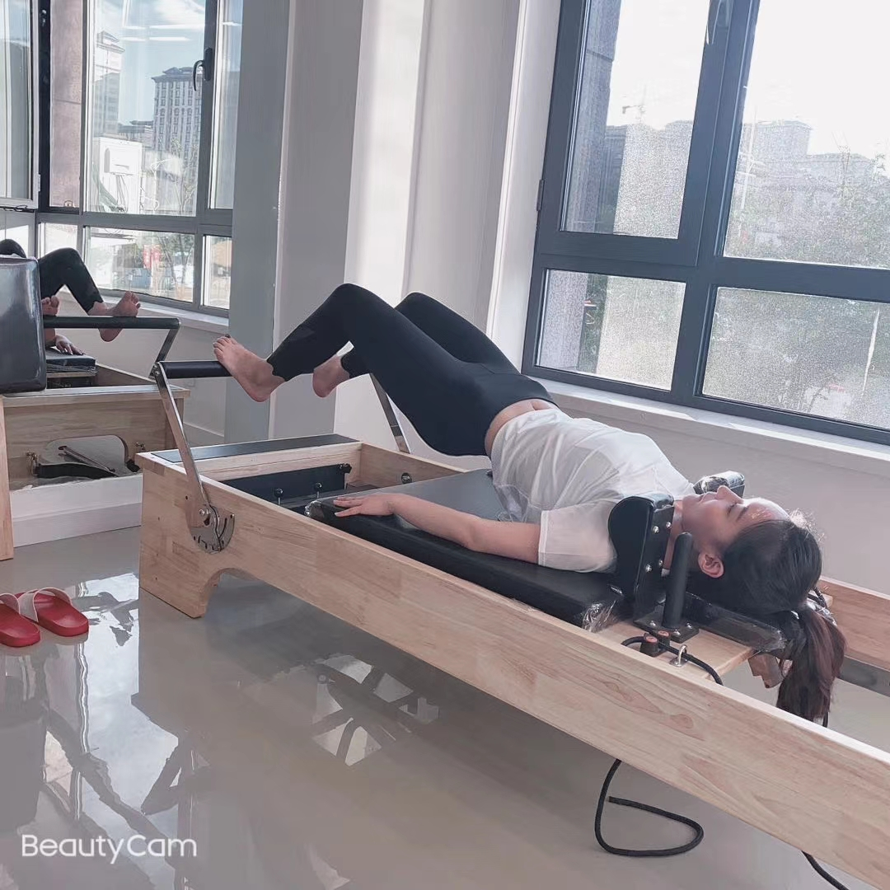

# 我为什么没有去找你

Send scheduled for Tue, Dec 1, 5:55 PM

今天我去找发型师了（从綦江到綦江东，从綦江东到重庆西，从重庆西到重庆北，再到凯韵酒店附近

他又给我讲了点东西

他说我长得不丑，甚至有点明星像。我不应该感到自卑。

然后我给他讲了我们的故事，他说我应该约你出来玩。

觉得好就应该去追，不能害怕拒绝。

他还说我的方法有点复古(其实是过时)，然后他还讲，这种方法有点书生气。他更偏向于使用社会的方法。

我回答道：所谓社会的方法，无非就是这个不行，就换下一个。

这是剪完后的样子：

.png>)

.png>)

.png>)

.png>)

.png>)

虽然发型设计师这么讲了，但是我还是有点害怕，毕竟怕搞砸了。

而且通过反思我的人生，我有一个感悟就是：高潮过后，是空虚。比起高潮，日常的刺激似乎更能让人感受到持久的快乐。

对了，这是没剪头发之前的样子(还不算丑，因为之前做的发型)：

这是没剃胡子的样子:

.png>)

哈哈，不刮胡子真的丑多了。小曾，你成功的影响了我的审美！

