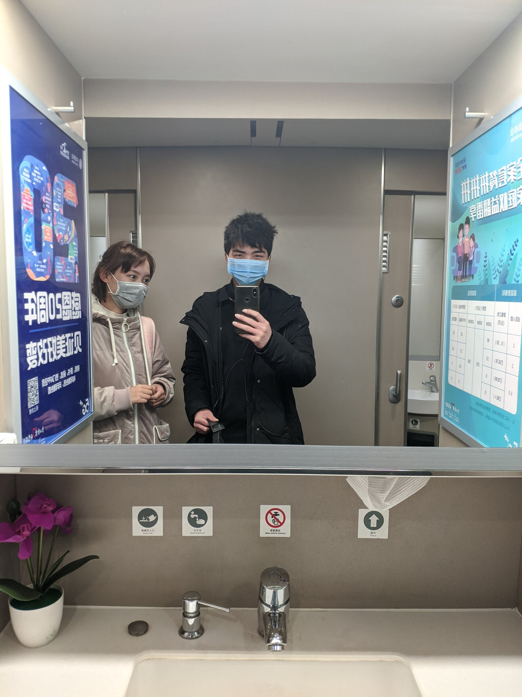

# 綦江通信工区的日常

## 日常

在綦江的生活还是比较安逸的。上午9点上班，中午12点下班。

只有走区间是最累人的活。

另外，感觉师傅对我越来越好了。基本上不安排我出去走区间。

## 一个人的产品经理

虽然空闲时间很多。但我依然感觉很迷茫。

因为我要做的事情太多了。

1. 我得想一个能挣钱的创意。
2. 我得构思这个产品，看我会用到哪些技术，能不能实现。
3. 我得自己实现这个产品，很明显，这会用到很多时间。并且，面对那些琐碎的技术要点、难点，没有耐心的人是做不下去的。
4. 然后我还得做一些与开发无关的事情，比如画Icons。
5. 接着我要做运维，我得管理整个软件的发布、更新。
6. 要是短时间内没有收益，我还得耐得住寂寞，持续更新这个产品。
7. 最后，如果我半途放弃的话，一切就得推倒重来。

## 一个人的时间精力总是有限的

不管怎么努力，有一个基本的事实是不会改变的。

那就是一个人的时间和精力总是有限的。

人们没有办法增加其总量。

人们唯一能做的事情就是珍惜时光，另外，只做必要的事情。

## 慢就是快

不要想太多，实力都是积攒出来的。

你一天能做到的事情，别人一天也能做到。

## 原生家庭的伤痛

不同的父母确实对孩子有不同的影响。

老是讲孩子笨、蠢、不努力，也确实会伤害到孩子的心灵。

我现在回想我自己，也确实有点讨厌原生家庭。所以不想回家。

同时呢，家里人管得太多也是一件不好的事情。让孩子失去了很多自己闯荡的机会。

我觉得，爱孩子，就应该善于发现孩子身上的优点，善于鼓励孩子去做自己喜欢做、并且愿意花时间去做的事情。

> 父母的智商与认知极限确实对孩子的成才有极大的限制作用。\(解决它只有一个办法： 逃离！可以像盖茨比一样物理逃离，也可以像中国旧时代很多学生一样，把老师视作父母，以老师的世界观与基准做事情、做选择。\(但现在的老师上课多半是为了赚钱，它才不管你成不成才呢。。\)\)

## 和年长几岁的一个年轻工友聊天

他描述了铁路职工黑暗的前途。

他说房子和车子并不是铁路职工可以找到对象的 等价条件。

单身是这个职业男性的普遍状态。

但事后我明白了他为什么单身。

这是我的日记：

> 我房间来了一个人，说我们这边的通信线挖断了，他们工区要来监视施工。他住了两天，明天还有一天。整天没事就刷抖音、玩王者荣耀，吵得我都没办法思考。我也不好说什么，毕竟他只住几天。
>
> 晚上3个小时写了平时三天才能写完的flutter代码
>
> 还是在安静的晚上效率高。（主要是从临时室友身上感受到了一股浓浓的乡土气息和不上进文化，我身边越是有这种东西，我越是不想随波逐流

## 和甘艳老师的深度对话

通过这次对话，确定了我要考研这件事。

还确定了，也许我会和曾宇欣结婚。

对话如下：

她：你准备考研吗？

我：不行啊。专科生怎么可能考研？再说我数学也过不了啊

她：你这么聪明，做事情又很专注，怎么可能数学过不了。

我：可以研究一下，毕竟机器学习还是要学数学的，不然看不懂论文。

她：专科生工作两年也可以考研啊，你可以拿在职的本科学历。

我：考研只是考试吗？我不想去学校学习。

她：考上研究生之后要在学校学习。但是不用统一上课，就是自己跟着导师做项目，写论文。

我：尝试在网上赚钱两年 和 尝试刷算法题两年 和 尝试学两年高等数学 之间 似乎并没有什么矛盾，就是 开发app、思考、学习思考。

我：这个可以，这样就可以顺理成章的不在铁路上班了。

我：而且**这个学习绝对是有益的，不仅利于我这一代实现阶级跳跃，还有利于下一代的培养（如果我会高等数学的话，那高中的数学或知识，就没什么难度了。我可以自己教孩子。**

她：是的。

她：你不要让你同事知道你考研的事情，因为你如果考上了就要离开这个单位了，所以不好。

我：这样啊。其实我早就给我工区的人讲了，我是在这里过渡。大概3、4年，2、3年就会走人。所以工长啥的都比较照顾我，不给我安排走区间的事情。现在整个工区都知道我会编程。

她：好吧。

我：你看，这就是我喜欢的那个女生。

她：哦，是这个叫曾宇欣的吗？这头像好像是个小孩的照片啊。

我：那是网图，她实际上和我年龄一样。

她：也是你们四川的女孩吗？一个单位也挺好的，会有很多时间和机会了解。

我：她是我小学一年级同学。之前因为我在新员工群里的语言过于独特，所以主动加的我。最开始我们都没有认出对方来。

我：她是本科生。而且非常的成熟。比我矮。

她：这么有缘啊！如果这个女孩目前是单身，那你们成对的几率很大啊。

我：她就是单身。我看一下微信能不能发长图，我找一下我们的聊天记录。

她：她是单身那你就离成功不远了。\(◠‿◕\)

她：你也可以结婚了读书，我们上研究生的时候，好多同门师兄弟孩子都10岁了还去读研。

我：（发了3张长截图）

我：好，目前就3张，现实生活中还发生了好多有趣的事，我都写了日记，但不方便发出来。你先看看聊天记录吧

我：很明显，她还是喜欢我的。只不过由于某些现实的原因：我没钱、她在车间我在工区隔太远\(铁路聚少离多\)、我空余时间得用来学习、我面对她有点紧张，不知道该说些什么、定职考试还没过（工作不稳定）。所以就一直没确定关系。

我：我估摸着她的意思就是让我先把事业稳定下来再说。比如通过过定职考试、构建稳定的passive income系统。

她：我看了你们的聊天记录了，作为老师和长辈，我说一下我的看法。

她：并没有感觉到她喜欢你。而且作为一个过来人，我觉得一般女孩子不会喜欢你这样的行为，因为你一直发大段的信息，而且有些话太大胆又很直白，这不会是女生喜欢的类型。

她：你跟女生讲话要含蓄点不要太直白。你跟我们讲话很直白，我们都觉得没关系，那是因为我们把你当小孩。但是你的同龄人会接受不了你讲的一些话。

我：她喜不喜欢我这并没有什么关系。我的生活仍然是在继续，依然不会堕落。喜欢，要努力，不喜欢还是得努力。不过接下来我还是得讲讲一些生活中的细节

她：当然生活还是要继续，工作也要努力。道路还很长，你才二十出头，后面肯定还会遇到很多喜欢的女孩。

她：我认为的追女生的好方法是，表白的话不用讲太多，默默付出实际行动。比如经常送点礼物，多点实际的关心爱护。适当的时机请吃饭看电影等等，最后很久后才表白。如果才认识没多久就表白的话，会吓到女生。

我：

1. 广安南可以直接到重庆，可她选择了从广安陪我一起（广安南是高铁；广安是普铁，脏乱差
2. 她除了陪我坐车那一次，后来再没有穿过精美的高跟鞋
3. 到实训基地前，一路上频频转过身来对我眉目传情
4. 我提出的保持步调这个请求，她不仅照做了，还做了一整天（那一天的实训，她都跟在我身后
5. 每次我上台演讲，她都故意上厕所（怕我当众表白，怕我出丑…）（但是演讲完毕，表演结束大家一起拍照时，却转过身来对我一直微笑）
6. 她签名上的“喜乐安康“是因为我跟她讲了我对铁路人身安全的担忧后她加上的。她签名上的“百事可乐”，是因为有一天实训，她坐我后面，我故意把百事可乐的那四个字对着她，她才加上的。
7. 还有好多...
8. 最近一个是朋友圈。我一直不发朋友圈、不点赞。 我跟她讲工作账号不用朋友圈，她朋友圈就一直不发东西了。 我今天发了一个考研的东西，她估计看到了。她转发了一条铁路的东西，意思是我先把这个搞定。 我顺势转发了一条，她主动给我点了赞。 我也顺势给她点了赞。 这样我们就实现了不聊天把信息传达的目的。

我：看了你的方法，觉得不适合我，但是符合实际情况。这就是为什么她老是抛出应急反应，直接拒绝，但事后又后悔，又想办法暗示我。主要是我太直白、太急。

我：你讲的东西，我一个都没能做到¯\_༼ᴼل͜ᴼ༽\_/¯

她：不适合你但是会适合追女生啊，你又不是女生。

我：晚安，老师。

## 非我族人

确实，完全透露自己的能力，在工作单位感觉不是那么好。

当然，这和思想也有很大的关系。我就是感觉自己的思维水平和同事们不在一个水平线，这个怎么做都没办法弥补\[mí bǔ\]。只能想办法play nice，尽量缓和一下关系。

## 又一次的火车搭讪

这次是意外。本来想去照镜子，结果遇到一个女生。她在化妆\(真奇怪，竟然有人在火车上化妆, 后来她说这是一种精致的生活态度\)。我全程站在旁边看。当她化完妆，我说：“其实你不用化妆也很好看。我是第一次看女生化妆，没想到这么多工序。”然后我们就聊上了。

在她化妆时还出现了一场意外，乘务员开始查票，我露出了工作证，她露出了家属证。\(后来证实她爸妈都是在重庆铁路工作，她爸是火车司机内勤，她妈也是后台工作。她在 重庆西下一站 遵义师范大学 读书，社会学专业，考虑转业；在重庆西下车，意味着在重庆西买了房子，并且当她以为我在重庆西买了房子之后，眼睛都亮了\(说明那是加分的一个好办法\(有这个条件，谈恋爱或结婚都更容易\)\)\)

得到结论: 

1. 本科的女生思维真的特别灵活。今天又测试了一下，发现她们善于计算，每次我和她们搭讪的时候，她们都会利用各种问题套出你的家庭背景、学识水平、收入水平，and so on. \(她一眼就看出了我的头发是烟花烫，看来是一个经常进理发店的人\) 

2. 铁路职工这个身份在铁路职工内部还是挺吃香的，她们不会瞧不起自己人\(不像我\)。 

3. 下次遇到合适的女生，愉快地聊天后应该加个微信，免得陷入被动\(或者错过好资源\)。

## 第二次剪头发

发型师陈老师还是挺好的，虽然在第一次剪发时坑了我一瓶油头膏\(20元的东西卖了80元\)。但后来的任务都完成得不错。他尽量地把我的发型做到了极致\(陈师傅的修眉功夫也是非常棒，几刀下去，就像换了一个人一样\)。

发型师请我吃了午饭\(一碗牛肉面\)。但实际上是对等的。我承诺每3个月去烫一次发，每一个月去剪一次头发。

\(发型师指，重庆北，凯韵花园酒店旁边的一个叫做“摩登造型”的小理发店的老板，真名 陈伟\)

## 思考公用性做笔记的方法

从重庆电务段段长的角度讲，他做3年笔记主要是围绕人事方面。他记录一切和人有关的东西。包括但不限于如何察言观色，如何说话，上下级是如何工作的，业务分配是如何完成的。经过时间的积淀，他最终可以摸清重庆电务系统的整个体系。

但我用笔记的方法稍微有点不同，我更侧重于记录自己对于生活的思考。

> plus: 我不用英语写日记，我用英语搞IT&AI

## 镜子与脱毛仪

在淘宝上买了4面镜子，把胶水用完后还是粘不上白粉墙。\(两面镜子都碎了，只能在淘宝再买30元的胶水和双面泡沫胶带\)

花99元在淘宝买了一个“光子脱毛仪”，用 最高输出功率+腿毛 隔着 屏幕保护膜 测试了一下，部分毛发被分解，有烧焦的味道。（说明确实可以通过光来给黑色物质加热，该仪器有效）\(我打算拿来去胡子\)

## 房子是个什么东西？

我老早就想写这篇文章了。

房子，说得简单点，就是一个能够遮风避雨的地方。它可以是茅草屋，也可以是水泥墙。

至于它的价值，我觉得水分很浓。很多时候，它的价格都是虚标，其建造的实际成本可能只占出售价的5%。

你至于在大城市去买几千万的房子吗？如果你花一两万就能在小城市买到同样大小、同样材料的房子。

对于程序员或者自由职业者来说，房子在哪儿买都一样，只要有网。车子完全不需要，因为不出门。

## 思维上的懒惰就是身体上的懒惰

思维是真实世界的先导，或者说是真实世界的模拟。

对于一切在现实世界发生的事物，如果你足够聪明，掌握了足够多的规律，就能够对他们进行成功的模拟与预测。你知道哪些事物是有关联的，你知道哪些事物接下来会发生。

最后送你一句话: 不要害怕去做难的事情，只有这些事情才会让你进步。

> 你前半生失败的地方藏在因你恐惧、害怕而不愿意坚持去做的事情上。（比如精通数学）

## 胡勇的来电

摘录：

屌丝一般都是几代屌丝。偶尔有个别混出来的屌丝，都是从小就住校的，长大后自己读大学，工作，基本上没有和父母一起生活过，受污染比较小。他们的思维更像是小知识分子，谨小慎微。 长期和劣质父母生活在一起的，基本都是劣质二代，很少有出息的。你想想是不是这样？

很多父母自己碌碌无为大半辈子，确总认为自己能给孩子这样的那样的，几乎是全方位的指导，仿佛不听自己的孩子就一辈子没出息。

大部分普通人的资源和关系，其实真不值钱。大之所以一事无成、后悔自己的选择，不是因为没关系，而正因为自以为有关系。我认识的很多人一毕业就回老家了，实际父母都是普通人。他们以为有关系，实际那点关系只能安排个普通工作，没任何成就和晋升路径。如果你足够相信自己，那点钱根本不叫钱。

日记： 

2020-11-18 14:51:58

原生家庭的伤痛

不同的父母确实对孩子有不同的影响。

老是讲孩子笨、蠢、不努力，也确实会伤害到孩子的心灵。

我现在回想我自己，也确实有点讨厌原生家庭。所以不想回家。

同时呢，家里人管得太多也是一件不好的事情。让孩子失去了很多自己闯荡的机会。

我觉得，爱孩子，就应该善于发现孩子身上的优点，善于鼓励孩子去做自己喜欢做、并且愿意花时间去做的事情。

> 父母的智商与认知极限确实对孩子的成才有极大的限制作用。\(解决它只有一个办法： 逃离！可以像盖茨比一样物理逃离，也可以像中国旧时代很多学生一样，把老师视作父母，以老师的世界观与基准做事情、做选择。\(但现在的老师上课多半是为了赚钱，它才不管你成不成才呢。。\)\)

事件： 

今天我一个程序员朋友 胡勇 给我打了一个视频电话。和我谈心，问我为什么那么害怕去实现自己的梦想。他说如果他像我这么热爱写代码，他就非常厉害了。他说要是他的英语像我这么好，他就什么都不怕了。他问我到底在怕什么。我一时竟然不知道怎么回答。

他是懂我的，毕竟都十几年的老朋友了。而且他是个传奇，他初中辍学，开过挖掘机、进过工厂、制过衣服、当过酒保、开过理发店、做过微商，最近一次“壮举”是花2万块钱参加前端编程培训，然后在3个月后经过十几家公司面试变成一名程序员。

我羡慕他，我佩服他，他的勇气是我所不具备的。最开始，他是在我大二期末给我打的电话，说他成功的在公司呆了2个月。我感到惊奇，因为据我所知，他没有任何编程背景。然后我便对他刮目相看，我不知道这位童年好友竟有如此大的本领，可以改变他的人生轨迹。要知道，他早前的朋友只能在流水线享受每天工作16小时，每月只有1天假的生活。

朋友也是出于好心，问我这个问题。现在回想起来，我遇到过的任何在乎我的好老师，都会不约而同地问我同一个问题：你为什么不考研？

我想这些问题已经有一段时间了，而且我觉得这也不是我一个人的问题。99%的人都有同一个问题，那就是：没有魄力，办事软弱、犹豫不决，孬种，没有勇气。\(对于其他人，还得加一个，不能坚持做一件事，但对于我来讲，这不是问题，我能坚持做一件事）

这也是所有平凡人共同的缺陷。

感想： 

开始思考我自己，既然我那么讨厌我父母，尤其是我爸爸那样安于现状、碌碌无为的样子。

为什么我还要再重复一遍？我是不是傻？

对策:

改变。因为 我前半生失败的地方藏在因我恐惧、害怕而不愿意坚持去做的事情上。（比如精通数学、各种算法）

每天必须持续学习。必须把数学踩在脚下，精通它。这样才能保证能够超越人才市场80%的人。

时机一到，就请长假或者辞职，去找工作。\(这里的时机指的是，上面的任务完成。大环境如疫情结束。\)

## 如何从自杀中获得动力

经过观察，我们发现很多的自杀事件，到了一定的进度，当事人就不想自杀了。但是由于物理条件限制，他们无法再回头，只能死去。

但如果我们换一个角度，尝试一种新方法，不仅可以让我们有更大的自由选择是否存活，还可以让我们从自杀事件中获得新的动力。

Here is how you do it, for example: 

1. Take a breath. 
2. Hold on and don't breathe, stay in this state as long as you can. 
3. If you have taken your mind to die, you should be able to die. But if you didn't make up your mind, you'll finally get another breath of fresh air.

Sometimes, you can even try more solutions, like trying to solve math problems without eating until you die, trying to build software without eating until you die.

Trust me, by doing this kind of self-killing activity, you'll be more and more storing from inside.

Yes, you can even try to kill yourself by doing body exercise, in this case, you would also get strength from outside, I mean, your body will be stronger and stronger than it was before.

用中文来讲，就是你可以尝试通过憋气来自杀，这样，你随时可以反悔，并继续存活下去。

