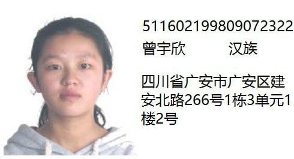
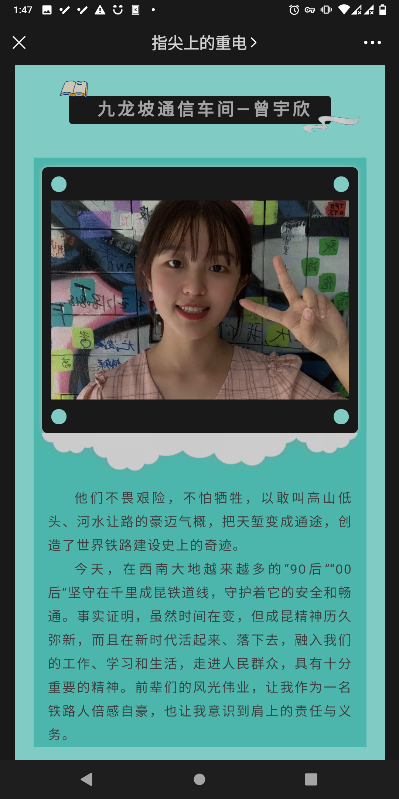
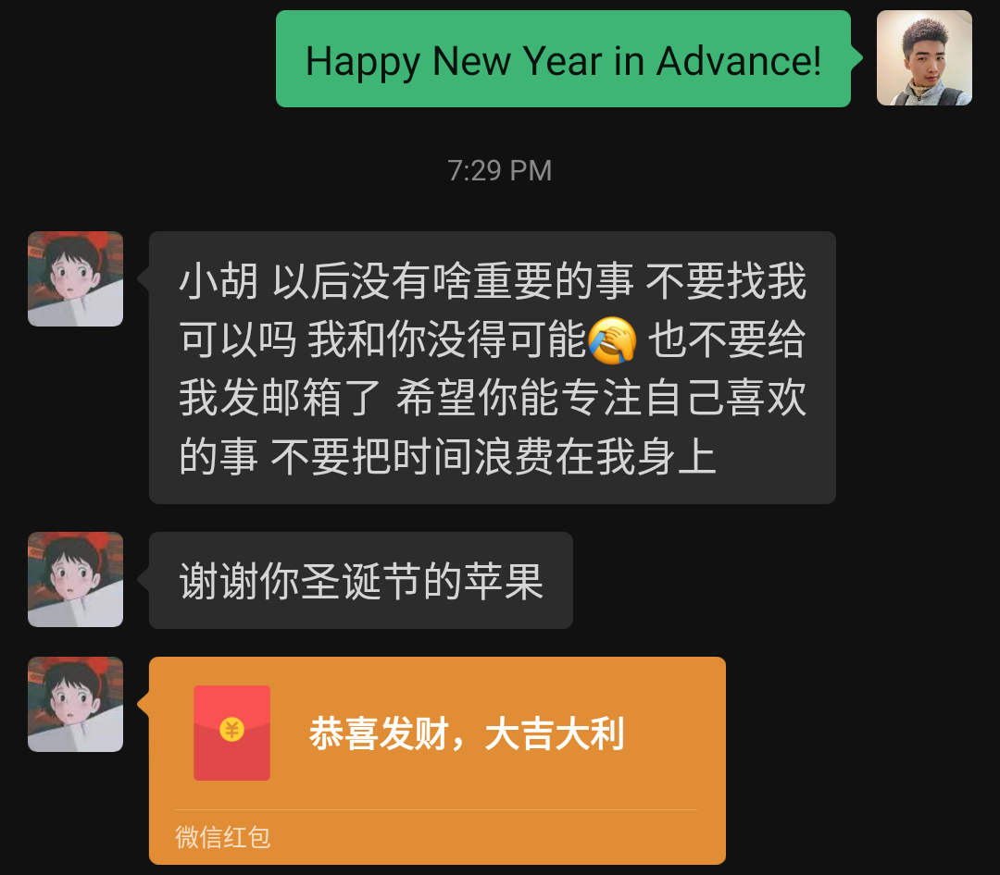
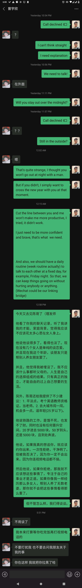
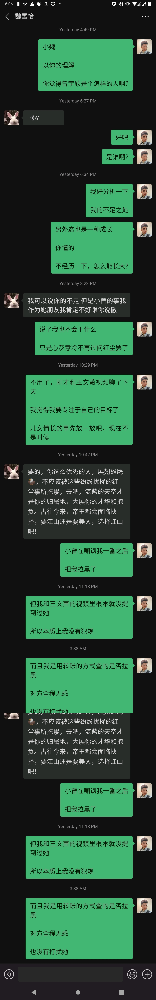

# 綦江通信工区的日常

## 日常

在綦江的生活还是比较安逸的。上午9点上班，中午12点下班。

只有走区间是最累人的活。

另外，感觉师傅对我越来越好了。基本上不安排我出去走区间。

## 一个人的产品经理

虽然空闲时间很多。但我依然感觉很迷茫。

因为我要做的事情太多了。

1. 我得想一个能挣钱的创意。
2. 我得构思这个产品，看我会用到哪些技术，能不能实现。
3. 我得自己实现这个产品，很明显，这会用到很多时间。并且，面对那些琐碎的技术要点、难点，没有耐心的人是做不下去的。
4. 然后我还得做一些与开发无关的事情，比如画Icons。
5. 接着我要做运维，我得管理整个软件的发布、更新。
6. 要是短时间内没有收益，我还得耐得住寂寞，持续更新这个产品。
7. 最后，如果我半途放弃的话，一切就得推倒重来。

## 一个人的时间精力总是有限的

不管怎么努力，有一个基本的事实是不会改变的。

那就是一个人的时间和精力总是有限的。

人们没有办法增加其总量。

人们唯一能做的事情就是珍惜时光，另外，只做必要的事情。

## 慢就是快

不要想太多，实力都是积攒出来的。

你一天能做到的事情，别人一天也能做到。

## 原生家庭的伤痛

不同的父母确实对孩子有不同的影响。

老是讲孩子笨、蠢、不努力，也确实会伤害到孩子的心灵。

我现在回想我自己，也确实有点讨厌原生家庭。所以不想回家。

同时呢，家里人管得太多也是一件不好的事情。让孩子失去了很多自己闯荡的机会。

我觉得，爱孩子，就应该善于发现孩子身上的优点，善于鼓励孩子去做自己喜欢做、并且愿意花时间去做的事情。

> 父母的智商与认知极限确实对孩子的成才有极大的限制作用。\(解决它只有一个办法： 逃离！可以像盖茨比一样物理逃离，也可以像中国旧时代很多学生一样，把老师视作父母，以老师的世界观与基准做事情、做选择。\(但现在的老师上课多半是为了赚钱，它才不管你成不成才呢。。\)\)

## 和年长几岁的一个年轻工友聊天

他描述了铁路职工黑暗的前途。

他说房子和车子并不是铁路职工可以找到对象的 等价条件。

单身是这个职业男性的普遍状态。

但事后我明白了他为什么单身。

这是我的日记：

> 我房间来了一个人，说我们这边的通信线挖断了，他们工区要来监视施工。他住了两天，明天还有一天。整天没事就刷抖音、玩王者荣耀，吵得我都没办法思考。我也不好说什么，毕竟他只住几天。
>
> 晚上3个小时写了平时三天才能写完的flutter代码
>
> 还是在安静的晚上效率高。（主要是从临时室友身上感受到了一股浓浓的乡土气息和不上进文化，我身边越是有这种东西，我越是不想随波逐流

## 和甘艳老师的深度对话

通过这次对话，确定了我要考研这件事。

还确定了，也许我会和曾宇欣结婚。

对话如下：

她：你准备考研吗？

我：不行啊。专科生怎么可能考研？再说我数学也过不了啊

她：你这么聪明，做事情又很专注，怎么可能数学过不了。

我：可以研究一下，毕竟机器学习还是要学数学的，不然看不懂论文。

她：专科生工作两年也可以考研啊，你可以拿在职的本科学历。

我：考研只是考试吗？我不想去学校学习。

她：考上研究生之后要在学校学习。但是不用统一上课，就是自己跟着导师做项目，写论文。

我：尝试在网上赚钱两年 和 尝试刷算法题两年 和 尝试学两年高等数学 之间 似乎并没有什么矛盾，就是 开发app、思考、学习思考。

我：这个可以，这样就可以顺理成章的不在铁路上班了。

我：而且**这个学习绝对是有益的，不仅利于我这一代实现阶级跳跃，还有利于下一代的培养（如果我会高等数学的话，那高中的数学或知识，就没什么难度了。我可以自己教孩子。**

她：是的。

她：你不要让你同事知道你考研的事情，因为你如果考上了就要离开这个单位了，所以不好。

我：这样啊。其实我早就给我工区的人讲了，我是在这里过渡。大概3、4年，2、3年就会走人。所以工长啥的都比较照顾我，不给我安排走区间的事情。现在整个工区都知道我会编程。

她：好吧。

我：你看，这就是我喜欢的那个女生。

她：哦，是这个叫曾宇欣的吗？这头像好像是个小孩的照片啊。

我：那是网图，她实际上和我年龄一样。

她：也是你们四川的女孩吗？一个单位也挺好的，会有很多时间和机会了解。

我：她是我小学一年级同学。之前因为我在新员工群里的语言过于独特，所以主动加的我。最开始我们都没有认出对方来。

我：她是本科生。而且非常的成熟。比我矮。

她：这么有缘啊！如果这个女孩目前是单身，那你们成对的几率很大啊。

我：她就是单身。我看一下微信能不能发长图，我找一下我们的聊天记录。

她：她是单身那你就离成功不远了。\(◠‿◕\)

她：你也可以结婚了读书，我们上研究生的时候，好多同门师兄弟孩子都10岁了还去读研。

我：（发了3张长截图）

我：好，目前就3张，现实生活中还发生了好多有趣的事，我都写了日记，但不方便发出来。你先看看聊天记录吧

我：很明显，她还是喜欢我的。只不过由于某些现实的原因：我没钱、她在车间我在工区隔太远\(铁路聚少离多\)、我空余时间得用来学习、我面对她有点紧张，不知道该说些什么、定职考试还没过（工作不稳定）。所以就一直没确定关系。

我：我估摸着她的意思就是让我先把事业稳定下来再说。比如通过过定职考试、构建稳定的passive income系统。

她：我看了你们的聊天记录了，作为老师和长辈，我说一下我的看法。

她：并没有感觉到她喜欢你。而且作为一个过来人，我觉得一般女孩子不会喜欢你这样的行为，因为你一直发大段的信息，而且有些话太大胆又很直白，这不会是女生喜欢的类型。

她：你跟女生讲话要含蓄点不要太直白。你跟我们讲话很直白，我们都觉得没关系，那是因为我们把你当小孩。但是你的同龄人会接受不了你讲的一些话。

我：她喜不喜欢我这并没有什么关系。我的生活仍然是在继续，依然不会堕落。喜欢，要努力，不喜欢还是得努力。不过接下来我还是得讲讲一些生活中的细节

她：当然生活还是要继续，工作也要努力。道路还很长，你才二十出头，后面肯定还会遇到很多喜欢的女孩。

她：我认为的追女生的好方法是，表白的话不用讲太多，默默付出实际行动。比如经常送点礼物，多点实际的关心爱护。适当的时机请吃饭看电影等等，最后很久后才表白。如果才认识没多久就表白的话，会吓到女生。

我：

1. 广安南可以直接到重庆，可她选择了从广安陪我一起（广安南是高铁；广安是普铁，脏乱差
2. 她除了陪我坐车那一次，后来再没有穿过精美的高跟鞋
3. 到实训基地前，一路上频频转过身来对我眉目传情
4. 我提出的保持步调这个请求，她不仅照做了，还做了一整天（那一天的实训，她都跟在我身后
5. 每次我上台演讲，她都故意上厕所（怕我当众表白，怕我出丑…）（但是演讲完毕，表演结束大家一起拍照时，却转过身来对我一直微笑）
6. 她签名上的“喜乐安康“是因为我跟她讲了我对铁路人身安全的担忧后她加上的。她签名上的“百事可乐”，是因为有一天实训，她坐我后面，我故意把百事可乐的那四个字对着她，她才加上的。
7. 还有好多...
8. 最近一个是朋友圈。我一直不发朋友圈、不点赞。 我跟她讲工作账号不用朋友圈，她朋友圈就一直不发东西了。 我今天发了一个考研的东西，她估计看到了。她转发了一条铁路的东西，意思是我先把这个搞定。 我顺势转发了一条，她主动给我点了赞。 我也顺势给她点了赞。 这样我们就实现了不聊天把信息传达的目的。

我：看了你的方法，觉得不适合我，但是符合实际情况。这就是为什么她老是抛出应急反应，直接拒绝，但事后又后悔，又想办法暗示我。主要是我太直白、太急。

我：你讲的东西，我一个都没能做到¯\_༼ᴼل͜ᴼ༽\_/¯

她：不适合你但是会适合追女生啊，你又不是女生。

我：晚安，老师。

我: 老师，要怎么样才能判定一个女人不是因为钱而喜欢自己呢？或者说，怎么判定一个女人不是因为看一个男人有前途才喜欢他的呢？

她: 判定她是不是因为钱喜欢自己?很简单啊，先想想自己有没有钱。 任何人的前途都是未知的，没有谁一定会有怎么样的前途。当然除了那些大富豪的子女。那个贪钱的女生会拿青春赌别人的前途?

我: 老师，你比我有智慧多了，我想了几天来着，只得到一个解决方案：“装穷”。（但这只能解决第一个问题；对于第二个问题，还是你比较厉害！\[ThumbsUp\]

她: 哈哈，这不是智慧，这是社会经验。

## 非我族人

确实，完全透露自己的能力，在工作单位感觉不是那么好。

当然，这和思想也有很大的关系。我就是感觉自己的思维水平和同事们不在一个水平线，这个怎么做都没办法弥补\[mí bǔ\]。只能想办法play nice，尽量缓和一下关系。

## 又一次的火车搭讪

这次是意外。本来想去照镜子，结果遇到一个女生。她在化妆\(真奇怪，竟然有人在火车上化妆, 后来她说这是一种精致的生活态度\)。我全程站在旁边看。当她化完妆，我说：“其实你不用化妆也很好看。我是第一次看女生化妆，没想到这么多工序。”然后我们就聊上了。

在她化妆时还出现了一场意外，乘务员开始查票，我露出了工作证，她露出了家属证。\(后来证实她爸妈都是在重庆铁路工作，她爸是火车司机内勤，她妈也是后台工作。她在 重庆西下一站 遵义师范大学 读书，社会学专业，考虑转业；在重庆西下车，意味着在重庆西买了房子，并且当她以为我在重庆西买了房子之后，眼睛都亮了\(说明那是加分的一个好办法\(有这个条件，谈恋爱或结婚都更容易\)\)\)

得到结论: 

1. 本科的女生思维真的特别灵活。今天又测试了一下，发现她们善于计算，每次我和她们搭讪的时候，她们都会利用各种问题套出你的家庭背景、学识水平、收入水平，and so on. \(她一眼就看出了我的头发是烟花烫，看来是一个经常进理发店的人\) 

2. 铁路职工这个身份在铁路职工内部还是挺吃香的，她们不会瞧不起自己人\(不像我\)。 

3. 下次遇到合适的女生，愉快地聊天后应该加个微信，免得陷入被动\(或者错过好资源\)。

## 第二次剪头发

发型师陈老师还是挺好的，虽然在第一次剪发时坑了我一瓶油头膏\(20元的东西卖了80元\)。但后来的任务都完成得不错。他尽量地把我的发型做到了极致\(陈师傅的修眉功夫也是非常棒，几刀下去，就像换了一个人一样\)。

发型师请我吃了午饭\(一碗牛肉面\)。但实际上是对等的。我承诺每3个月去烫一次发，每一个月去剪一次头发。

\(发型师指，重庆北，凯韵花园酒店旁边的一个叫做“摩登造型”的小理发店的老板，真名 陈伟\)

## 思考公用性做笔记的方法

从重庆电务段段长的角度讲，他做3年笔记主要是围绕人事方面。他记录一切和人有关的东西。包括但不限于如何察言观色，如何说话，上下级是如何工作的，业务分配是如何完成的。经过时间的积淀，他最终可以摸清重庆电务系统的整个体系。

但我用笔记的方法稍微有点不同，我更侧重于记录自己对于生活的思考。

> plus: 我不用英语写日记，我用英语搞IT&AI

## 镜子与脱毛仪

在淘宝上买了4面镜子，把胶水用完后还是粘不上白粉墙。\(两面镜子都碎了，只能在淘宝再买30元的胶水和双面泡沫胶带\)

花99元在淘宝买了一个“光子脱毛仪”，用 最高输出功率+腿毛 隔着 屏幕保护膜 测试了一下，部分毛发被分解，有烧焦的味道。（说明确实可以通过光来给黑色物质加热，该仪器有效）\(我打算拿来去胡子\)

## 房子是个什么东西？

我老早就想写这篇文章了。

房子，说得简单点，就是一个能够遮风避雨的地方。它可以是茅草屋，也可以是水泥墙。

至于它的价值，我觉得水分很浓。很多时候，它的价格都是虚标，其建造的实际成本可能只占出售价的5%。

你至于在大城市去买几千万的房子吗？如果你花一两万就能在小城市买到同样大小、同样材料的房子。

对于程序员或者自由职业者来说，房子在哪儿买都一样，只要有网。车子完全不需要，因为不出门。

## 思维上的懒惰就是身体上的懒惰

思维是真实世界的先导，或者说是真实世界的模拟。

对于一切在现实世界发生的事物，如果你足够聪明，掌握了足够多的规律，就能够对他们进行成功的模拟与预测。你知道哪些事物是有关联的，你知道哪些事物接下来会发生。

最后送你一句话: 不要害怕去做难的事情，只有这些事情才会让你进步。

> 你前半生失败的地方藏在因你恐惧、害怕而不愿意坚持去做的事情上。（比如精通数学）

## 胡勇的来电

摘录：

屌丝一般都是几代屌丝。偶尔有个别混出来的屌丝，都是从小就住校的，长大后自己读大学，工作，基本上没有和父母一起生活过，受污染比较小。他们的思维更像是小知识分子，谨小慎微。 长期和劣质父母生活在一起的，基本都是劣质二代，很少有出息的。你想想是不是这样？

很多父母自己碌碌无为大半辈子，确总认为自己能给孩子这样的那样的，几乎是全方位的指导，仿佛不听自己的孩子就一辈子没出息。

大部分普通人的资源和关系，其实真不值钱。大之所以一事无成、后悔自己的选择，不是因为没关系，而正因为自以为有关系。我认识的很多人一毕业就回老家了，实际父母都是普通人。他们以为有关系，实际那点关系只能安排个普通工作，没任何成就和晋升路径。如果你足够相信自己，那点钱根本不叫钱。

日记： 

2020-11-18 14:51:58

原生家庭的伤痛

不同的父母确实对孩子有不同的影响。

老是讲孩子笨、蠢、不努力，也确实会伤害到孩子的心灵。

我现在回想我自己，也确实有点讨厌原生家庭。所以不想回家。

同时呢，家里人管得太多也是一件不好的事情。让孩子失去了很多自己闯荡的机会。

我觉得，爱孩子，就应该善于发现孩子身上的优点，善于鼓励孩子去做自己喜欢做、并且愿意花时间去做的事情。

> 父母的智商与认知极限确实对孩子的成才有极大的限制作用。\(解决它只有一个办法： 逃离！可以像盖茨比一样物理逃离，也可以像中国旧时代很多学生一样，把老师视作父母，以老师的世界观与基准做事情、做选择。\(但现在的老师上课多半是为了赚钱，它才不管你成不成才呢。。\)\)

事件： 

今天我一个程序员朋友 胡勇 给我打了一个视频电话。和我谈心，问我为什么那么害怕去实现自己的梦想。他说如果他像我这么热爱写代码，他就非常厉害了。他说要是他的英语像我这么好，他就什么都不怕了。他问我到底在怕什么。我一时竟然不知道怎么回答。

他是懂我的，毕竟都十几年的老朋友了。而且他是个传奇，他初中辍学，开过挖掘机、进过工厂、制过衣服、当过酒保、开过理发店、做过微商，最近一次“壮举”是花2万块钱参加前端编程培训，然后在3个月后经过十几家公司面试变成一名程序员。

我羡慕他，我佩服他，他的勇气是我所不具备的。最开始，他是在我大二期末给我打的电话，说他成功的在公司呆了2个月。我感到惊奇，因为据我所知，他没有任何编程背景。然后我便对他刮目相看，我不知道这位童年好友竟有如此大的本领，可以改变他的人生轨迹。要知道，他早前的朋友只能在流水线享受每天工作16小时，每月只有1天假的生活。

朋友也是出于好心，问我这个问题。现在回想起来，我遇到过的任何在乎我的好老师，都会不约而同地问我同一个问题：你为什么不考研？

我想这些问题已经有一段时间了，而且我觉得这也不是我一个人的问题。99%的人都有同一个问题，那就是：没有魄力，办事软弱、犹豫不决，孬种，没有勇气。\(对于其他人，还得加一个，不能坚持做一件事，但对于我来讲，这不是问题，我能坚持做一件事）

这也是所有平凡人共同的缺陷。

感想： 

开始思考我自己，既然我那么讨厌我父母，尤其是我爸爸那样安于现状、碌碌无为的样子。

为什么我还要再重复一遍？我是不是傻？

对策:

改变。因为 我前半生失败的地方藏在因我恐惧、害怕而不愿意坚持去做的事情上。（比如精通数学、各种算法）

每天必须持续学习。必须把数学踩在脚下，精通它。这样才能保证能够超越人才市场80%的人。

时机一到，就请长假或者辞职，去找工作。\(这里的时机指的是，上面的任务完成。大环境如疫情结束。\)

## 如何从自杀中获得动力

经过观察，我们发现很多的自杀事件，到了一定的进度，当事人就不想自杀了。但是由于物理条件限制，他们无法再回头，只能死去。

但如果我们换一个角度，尝试一种新方法，不仅可以让我们有更大的自由选择是否存活，还可以让我们从自杀事件中获得新的动力。

Here is how you do it, for example: 

1. Take a breath. 
2. Hold on and don't breathe, stay in this state as long as you can. 
3. If you have taken your mind to die, you should be able to die. But if you didn't make up your mind, you'll finally get another breath of fresh air.

Sometimes, you can even try more solutions, like trying to solve math problems without eating until you die, trying to build software without eating until you die.

Trust me, by doing this kind of self-killing activity, you'll be more and more strong from inside.

Yes, you can even try to kill yourself by doing body exercise, in this case, you would also get strength from outside, I mean, your body will be stronger and stronger than it was before.

用中文来讲，就是你可以尝试通过憋气来自杀，这样，你随时可以反悔，并继续存活下去。

## 一次考试，多种收获

这本来是一场平凡的考试。但由于某些幕后人员，或者上层官僚的别有用心，变成了一场有意思的考试。

事件经过如下：

本来以为在学校考过中级工的实习生不用考试了，但是突然间就通知要考试了。换个说法，就是邻近考试前一天，才通知你要考什么。

所以我就根据考试范围，准备了一个软件题库。然后花了一天下午和半个晚上，把1300道题刷了3.5遍。

然后我就考了81分。然后其他的考生都不及格。

但重点不是这个，重点是通过这个事件，我又获得了新的动力。\(一部分指的是车间领导们肯定的目光，另一部分来自于小曾\)

说到小曾，她过得可滋润了，在一个充满单身汉的世界里，女生就是王者，漂亮的女生就是上帝。

我去到九龙坡车间的时候，特地先跑到集中修工区看一眼。

发现她悠然地躺在摇倚上，没有什么事情需要做。然后她转身了，当我们的眼神对碰的时候，我知道该把半开的门缝给关上了，因为还是有感觉。

然后我打了两次电话，一次是表明我来了，问一下食堂在哪儿，说一下我是来考试的，另一次是表明我要离开了，如果她不打算带我参观一下她的寝室的话，我马上就离开。

第二天一睡醒我就知道问题出在哪里了。他们只是想给那些没参加中级工考试的学员一些压力。让他们更好的准备定职考试。

## 自主的人生才是有意义的

人与人之间最主要的差别是，有的人左右自己的人生，有的人的人生被别人左右。

严格意义上讲，我的前半生在高二之前，都是在随波逐流，\(小学\)没有东西可学了，\(初中\)学习难度增大了，就放弃了。这是不对的，因为99%的人放弃，不代表你就应该放弃。永远做那1%，应该成为你的信仰。

高二之后，情况有所改观，有一件事情是我觉得不应该再忍的: “为什么别人都能学好英语，就我不会？”

这个信条随着疯狂英语的到来，开始在我心里发芽。

我不应该沉睡下去了，我应该做点什么。于是我用尽我人生的每一份每一秒在英语的识读、翻译、记忆上。最后我成功了，我征服了英语。

可是高考不等人，你才克服了一个恐惧，数学呢？不及格。政史地呢？害怕记忆的你退缩了，只有历史及格，因为它只需要理解且真实有趣没受太多污染。

在遭受打击之后，你做了什么？你重新拿起了编程的武器，你还是热爱它的，从初中开始就一如既往。只不过现在，你换了一种方式，用你热爱的英语去征服它。

你发现，天啊，英语和编程简直是一对儿。它们紧密相连，两个喜欢的东西碰到一起来了，你更喜欢它们了。

可是亲爱的，你仍在逃避，你可知道你最害怕的数学在不远处看着你。你不愿意面对它导致了你错过很多从学历上进行阶级跳跃的机会。

你害怕吗？你还想逃避吗？你觉得你能逃得了数学的魔爪吗？

不，你逃不掉。在编程上花费了日以继夜的时间之后，你渐渐发现，任何的尖端科技，都是要写论文的。

而这些论文，虽然是公开发表的。但如果你没有优秀的高等数学基础，是没办法看懂的。于是你开始陷入沉思，因为大学里教那些数学原理不足以让你看懂那些复杂的公式。

但如果你不能够看懂那些复杂的公式，就没办法研究尖端科技。如果你没办法研究尖端科技，你就还在和其他人拼时间和生产效率。你一个人PK整个大型公司？你脑子还是正常的吧？

综上所述，你已经没有任何退路了，除了和数学来一场亲密接触，并且爱上她，别无它法。

什么? 你不懂它？行！那就天天和它接触，再讨厌也要这么做。只有这样，最终math才会成为你的朋友。

而你人生的最大恐惧才能被消除。

这个恐惧不存在于学历，而是你自己，你是否相信你是最棒的那一个。你是否能够学会任何你想学会的东西。

So, kids, put on your smile, let's see if you can make it or not with a positive attitude and actions.

## 2020年12月18号纪实回忆录

这一天是充满激情的一天。我和甘艳老师两个人都思考了好多东西。关于未来，关于前途。

甘艳老师是好样的。我人生几乎没有遇到这么负责任的老师。如此的把学生是否成才放在心上。

在前几天，甘艳老师仔仔细细地和我探讨了关于我要怎样才能从专科生直接考研。其中谈到一个学校，“杭州电子科技大学”，其招生简章这么写：

> （3）获得国家承认的高职高专毕业学历后满2年（从毕业后到录取当年入学之日，下同）或2年以上的人员，以及国家承认学历的本科结业生，按本科毕业同等学力身份报考。同等学力考生须满足下述条件：a.大学英语四级考试成绩425分及以上；b.已修完所报考专业大学本科6门及以上主干课程（不包括公共课），且成绩合格（需出具由自考、成教或进修院校教务部门盖章的成绩单）；c.以第一作者、通讯作者或第二作者在报考专业相关领域的核心及以上级别的学术期刊上发表学术论文至少一篇（学术期刊级别以我校科研院最新版本为准）。初试成绩合格后,复试时加试两门大学本科主干课程,具体加试科目请在招生目录查看。

当时我就知道，b项不可能被完成。\(但c项可以，因为甘艳老师老早就开始筹划在期刊论文里加上我的名字\)

在几经波折之后，今天，我们最终达成了一个共识。我应该先“由专科升至本科”，这样才能用本科生的身份去考研。

接着我们继续商讨，甘艳老师在经过同校老师的一番询问之后，给我推荐了"北京交通大学 远程教育"，我选了“计算机科学与技术”。我打了成都站“四川交通学习中心”的电话咨询，并报名。

> | 10004003 | 北京交通大学现代远程教育成都交通校外学习中心 | 成都市红牌楼佳灵路 | 四川省交通管理学校 | 杨永碧 | 028-85094025 |
> | :--- | :--- | :--- | :--- | :--- | :--- |

我与甘艳老师的部分聊天记录:

她: 如果你以后纯做软件编程，我觉得路会很窄；如果你学的专业能够跟实际的硬件和控制系统结合起来会好点。因为纯软件编程是吃年轻饭的，而且会很累。 

我: 计算机科学与技术，现在升本应该还好吧，以后再考虑转专业的事情。

她: 我前段时间出去学习，中车研究所有个博士是华科毕业的，他提到了深度学习，模式识别，他还给我们看了他博士期间做实验的东西，他各个方面都懂。

我: 这就是我要学的东西啊，人工智能和数据科学。

她: 但是你学计算机科学，你会涉及到机器人的硬件的控制吗？

我: 当然会拉，不然你以为他们是干什么的，底层C语言学一遍。C就是写硬件程序的。

她: 怎么说呢，我也不知道怎么表达。总之呢，我的意思就是，人要活很久的，不是只有年轻这几年时光，要把眼光放长远一点，不能只考虑眼前挣多少钱吧。可能我这个人比较俗，哈哈。

她: 因为我觉得你可以学的综合一点，做的事情综合一点。不要把路走的太窄。

我: 我也没说我一定要辞职啊。但是人都有个点，到一个点受不了了，或者没有时间学习了，就该走人了。

她: 我不是指你辞职这个事情。我是指你到时候读研究生选专业这个事情，你父母支持你考研读研吗？

我: 支持啊！我之前讲工作两年后就可以考研，他们没反对啊，还很高兴呢！觉得家族里总算出了个本科生。

她: 那你就好好学习，提高学历，不要考虑挣钱的事情。

我: 这个需要考虑。没有一夜暴富的事，只有不断尝试、失败，最终成功的故事。

我: 反正都是做软件，搞开源和商业软件没啥差别，投入都一样，收获却不同。在我这里，尝试赚钱=尝试写一个赚钱的软件或者游戏。

我: 学数学、学英语，最终都只是为了写出更好的程序、更智能的程序、更让人上瘾的游戏，不要把主次给颠倒了。如果只是为了学历去学习，是学不进去的，因为那个目标是空的。而只是为了写出更好的软件或游戏去学习，也是无法支撑现实生活的。只有把学习、生产、获利结合起来，人生才有动力，未来才有期待。把命运放在别人手上，终究是不靠谱的\[Smile\]。

她: 给你看一个东西，是丁祁正老师写的，他让我好好看看，说对培养我的小孩有用处。丁老师很厉害的。\(丁祁正 是指导我参加电子设计竞赛的另一位老师，前导弹研究所研究员\)

> **华罗庚纪念馆参观后记**
>
>  2020年12月13日，周日。与夫人去茅山脚下的得撒豆腐村游览，后顺道去金坛参观了华罗庚纪念馆。
>
>  华罗庚先生是从小敬仰的数学家，以前听老师说过，华老小时候家里贫穷，且腿有残疾，靠自学数学而成才。但参观了华老纪念馆，了解到华老的生平后，才知道他的成功绝不是如此简单。
>
>  首先，华老能在旧社会上学读书，且考上上海的学校就读，说明其家庭对读书教育还是比较重视的，而且家里至少是有一点底子。去上海读书前\(17岁）那年就成家了，说明家里不是穷的连书都读不起。其次，华老有数学天赋，但也一定受到名师的引导，所以才能在19岁那年（得伤寒卧病在家）能写文章发表，并引起清华大学数学系熊庆来先生的注意。后来熊先生将华老招聘到清华，解决了其生活和学习问题。后来华老在清华如鱼得水，很快就得资助前去英国留学，并在留学期间发表了很多重要的研究成果。正是在英国留学期间发表的论文，奠定了其在国际数学界的地位。至此可以说华老真正成才了。以后回清华任教授，到美国任教授并获得美国科学院院士荣誉，这些就顺理成章了。
>
>  纵观华老的成才经历，可以总结以下几点：
>
> 1.  个人需要有对某个领域的热情和兴趣，并有相应的天赋；
> 2.  成长道路上要有名师的引导和帮助；
> 3.  自己始终不断的努力，这是最重要的；
> 4.  家庭和周围环境的宽松以及世界观的正确。
>
>  以上几点缺一不可。如果家庭和周围环境不以学习为荣，而是以一般人的财富为目的，那么你即使有才有天赋，也可能受到不断的影响而不能专注于某个领域，不能在该领域内始终如一的走下去，也就不会有最终的成功。
>
>  如果你有天赋，但成长的道路上得不到名师的指导和指点，那你很可能就在较低的层次上打转转，而不能进一步的得到提升，也不知道自己要向什么方向努力和发展，最终不能取得可观的成就。
>
>  最重要的是，即使自己有某方面的天赋和兴趣，但如果不能始终如一的努力，那么在前进的道路上总会被一些其他事情所打扰，而不能稳步前进，最终也不可能走远。
>
>  华老的成长经历，和古人《道德经》中说的暗合。《道德经》中说道，“是以圣人处无为之事，行不言之教，万物作焉而不辞，生而不有，为而不恃，功成而弗居。夫唯弗居，是以不去。”这段话一般人理解为圣人以身作则，身教重于言教，凡事有成就了也要保持虚心低调，不要居功自傲。这样的理解不能说错，但至少是不全面的。联系道德经的基本思想是万物都是对立统一的关系，有无同出而异名，同谓之玄。玄之又玄，众妙之门。无为与有为是同一事物的不同阶段，或者说两个方面，是对立的统一，以此来理解这段文字的本意是：圣人为了有为，都是从无为之事做起，为了推行教化（立言），都是从不言处着眼。万物产生而不辞让，滋长而不固有，运作而不囿步，成功了也不停留。正由于不停留，所以生生不息，不会消失。尤其是最后的“夫唯弗居，是以不去”，不是功成不居的现代意思，而是成功了也不停止，所以生生不息的意思。
>
>  《道德经》后面还说到，为不为，而无不为。就是凡事有目标，脚踢实地，从小处着手，逐渐积累，则没有什么目标不能达到！
>
>  这几段话和华老的成长几乎完全吻合。这就是“道”！是一个人的成长之道！
>
>  如果觉得华老的成长仅是个例，那么我可以再举一个实例，关于我的大学同班同学沈向洋的事例。沈向洋大学毕业后，直接攻读研究生，毕业后不是去工作，而是去香港中文大学继续攻读研究生，后来又接着去美国卡耐基梅龙大学攻读博士，直到1996年才参加工作。在微软公司工作后，又与当时几位国际一流人物（李开复、张亚勤等）一起回到北京，成立微软亚洲研究院和工程院，并在这里工作。逐步成长为研究院负责人，微软副总裁等。他的成长过程几乎符合前面总结的几条。
>
>  天赋+名师+家庭环境+自身持续努力！
>
>  如果沈向洋和我们其他人一样，大学毕业就去参加工作，那么他不可能在特定领域达到国际一流的水平；或者研究生毕业后即参加工作，同样不能在特定领域达到国际一流的水平。如果没有达到国际一流的水平，那么也不可能成长为国际一流的人才！如果自身不是持续的努力，那也不能攀登特定领域的高峰。所以，一个人才能成长起来，不是像一般人理解的那样要么完全靠自学、要么靠偶然的机遇，而是上述几方面的因素的综合。
>
>  那么如果有这么一个人，他脑子还可以，对某领域也比较有兴趣，如何能培养成为一个“人才”呢？我觉得可以遵循前面说的几个方面加以引导。
>
> A. 首先树立不以财富和其他一般生活欲望满足为目标的世界观。
>
>  和道的追求相比，财富是末。如果一切以财富论英雄，那么一切也就无从谈起了。但是财富并不是完全不要，而是要有个度。能满足一般生活和学习之资就可以了。树立真理追求的目标比什么都重要！目标明确坚定，才能在成长的道路上不被其他诱惑所俘虏，才能排除周围环境中各种杂音的干扰，才能始终围绕着自己的既定目标不断前进。
>
> B.  要努力得到“名师”的指点。
>
>  所谓名师也是没有定数和止境的。在一所学校，一个地区，某个人可能算得上是名师，但是范围再大一点，可能就算不上名师了。所以，作为一个学生，就要展露头角，得到更高层次名师的注意，并争取能得到更高层次名师的指引和点拨。那么如何展露头角呢？最好的方法和途径就是及时将自己的研究成果发表，同该领域的人分享。这样，该领域的名师才有可能将目光投到你的身上。
>
>  除此以外，还应该主动出击，了解所在领域的领军人物，并尽可能与之联络，并将自己的想法和成果与之探讨。当然，这里所讲的主动与名人联络目的是为了得到名师的指点和引导，绝不是为了增加自己身上的光环，拉名师为自己的名气做背书。实际上，在成长的过程中，要将自身的名气之类的想法完全抛弃！心中只有求道！
>
>  最重要的，目光要放远，要有全世界和全人类的胸怀。不能固步于一个地区、一个国家，而是追求人类最高目标。
>
> C.  逐步积累原则
>
>  做任何事，都要从小处着手，要一步一步前进。目标虽然远大，要成为某个领域的顶尖，也要从最基本的事情着手，基础要扎实，这样才能走的远，走的稳。
>
>  总之，天赋是基础，自身努力是根本！天赋和自身努力是内因，名师的指点和帮助是外因，外因必须通过内因才能起作用。而外因离开内因也是没有用的。人才的成长也是有规律的，这就是“道！”
>
>  其他领域的成长，是否也可以用这里所述的道理参照呢？

我: 我给你看看今天，在看这篇观后感之前我写的东西:

> 此处内容等同于《自主的人生才是有意义的》

我: 然后是看完丁老师文章后的文字: 

> 最开始我的想法是：学英语 
>
> 后来我的想法是：学编程 
>
> 然后我的想法是：学AI 
>
> 接着我的想法是：没数学基础，没学会 
>
> 再然后我的想法是：再学一遍数学

> 最开始我的想法是：精通英语 
>
> 后来我的想法是：精通编程 
>
> 然后我的想法是：精通AI，移民去美国搞AI研究 
>
> 接着我的想法是：没数学基础，没学会 
>
> 再然后我的想法是：先挣钱吧，资金移民 
>
> 再然后我的想法是：技术没达到顶级，再学一遍数学，把技术达到顶级再赚钱 
>
> 最终的想法是：我要开一家公司，招聘梦想家们来改变世界

## 第一次用医保余额购买护肤品

我花了400元，买了一套护肤品，感觉很高大上，量也比较少。第一次用，感觉效果还不错。

* 薇诺娜，舒敏保湿洁面乳\(Anti-Sensitive Moisturizing Cleansing Foam\)
* \*\*\*, 保湿喷雾\(Anti-Sensitive Moisturizing Spray\)
* \*\*\*, 保湿特护霜\(Anti-Sensitive Moisturizing Tolerance-Extreme Cream\)

果然好看是保养出来的。

## 来自新年的晴天霹雳

## 来自新年的晴天霹雳2

## 来自新年的晴天霹雳+祝福

刚才和同事“王文潇”聊了聊。发现这个人确实是个人才。

他想提升学历，这一点确实和我有了重合。

他觉得做事应该稳扎稳打，这个事情我也觉得还行。

我觉得他很适合做小曾的男朋友。

而小曾已经给了我祝福。她祝我事业有成！

> 要的，你这么优秀的人，展翅雄鹰🦅，不应该被这些纷纷扰扰的红尘事所拖累，去吧，湛蓝的天空才是你的归属地，大展你的才华和抱负。古往今来，帝王都会面临抉择，要江山还是要美人，选择江山吧！

小曾在嘲讽我一番之后

把我拉黑了

## 昨天到底发生了什么，我的新年为何如此纠结

根据我的臆想，或者说推测。小曾根本没有男朋友，如果说有，那就是我。

我只是觉得好烦，在写完了一篇文章《小曾与我》之后，便继续写了《Review in 2020 and Plans for 2021》

## 顿悟

一睡醒，就想通了

她真是个天才

做的一切都是为别人着想

前天那一套是励志计划

昨天那一套是悲伤控制，不波及其他人

## 在无法存活的世界里存活

我们生活在一个混乱的世界里。

有些人选择沉迷，沉迷于某些让人沉迷的幻象之中。

而另一些人，像我，仍在坚持。

渴望着有一天，有一天破茧重生，带着信念与梦想。

在自由的草地上高歌。

