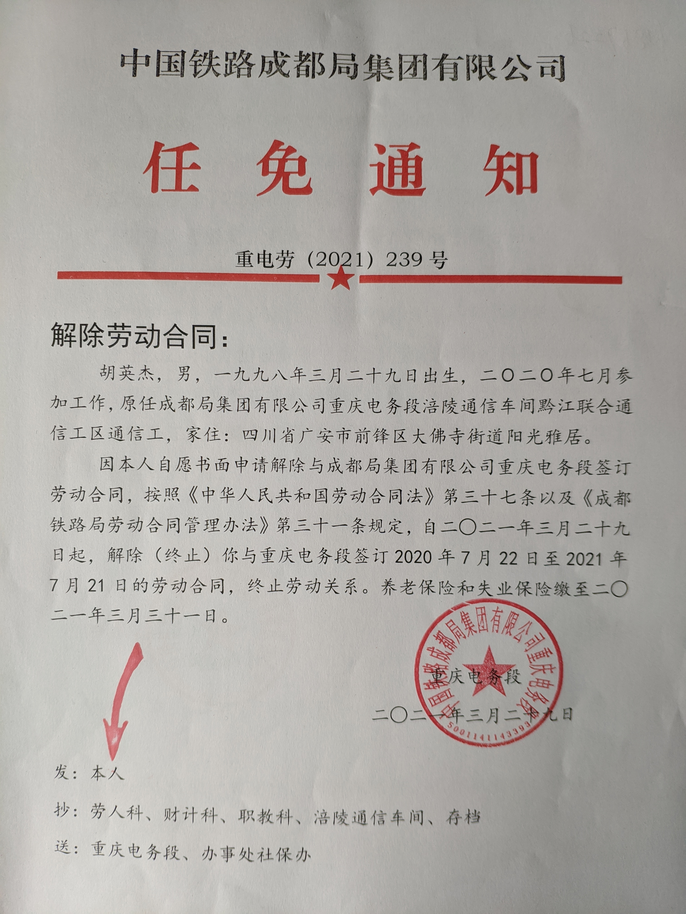

# 黔江通信工区的日常

## 开始之前

在一切开始之前，我们得先做总结，我们得知道哪里有问题，怎样避免。

1. 不要成为一个普通的工人。(从老工区邓师傅的经历来看，一个普通工人，就是再聪明，也只是在碌碌无为地浪费生命)
2. 不要对国企的晋升机制抱有任何的幻想。

解决方法: 抓紧每一分每一秒，努力学习高等数学，考上研究生。或者实现财务自由，尽快脱离这个环境。

## 一开始，就百般暗示

才来，供电的某副工长就百般暗示，说，他在这儿待了几十年，是调不走的。

然而我根本就不屑。我根本就对这个系统不报任何希望。

并且我觉得所有铁路工人都属于底层人民，都是垃圾。

垃圾在哪儿都是垃圾。

早日跑路，才是正解。

## 一封辞职申请

我觉得铁路的工作不适合有理想的年轻人。

整日地坐车在破碎的烂泥地里颠簸，这样的人生是没有前途的。

不需要很久的时间，人的意志就会被消磨，人的智力就会衰退。

而一个人之前有过的一切技能都会化为灰烬，只剩下无穷的体制下繁琐而没有意义的日常计划。

我现在还年轻，有的是时间和精力去适应一个新的职业。没有必要把自己浪费在一个看不到任何希望，且让自己每日都感到痛苦的行业上去。

朋友说了，你已经浪费了3年+6个月的时间，你不能再继续沉沦于这个事情上，人生需要及时止损。

我记得我之前给我熟悉的人们讲过一句话，我说: 要是我30岁之前不能达到自由的生活，我就去死。

有了这句话做铺垫，我开始以为我在铁路上还可以有那么一点点自由，结果发现你们连寝室里的东西怎么摆放都要管，这实在是不符合一个正常企业可以干的事情。就这一点，我觉得，我再也没有办法把工区当成我的家了。如此一来，铁路就失去了任何它能够吸引我的地方。

底工资、严管理、一堆形式化主义的破事儿、这只看不见的手竟然还伸进了员工的宿舍，仿佛在说着，你们的一切都是我给予的，你没有任何选择权，你也没有任何自由。

在私企就不一样了，还不用等老板开除我呢，我就能先跳槽。

综上所述，我申请辞职。

## 辞职跑路

我已经从铁路局辞职了。

