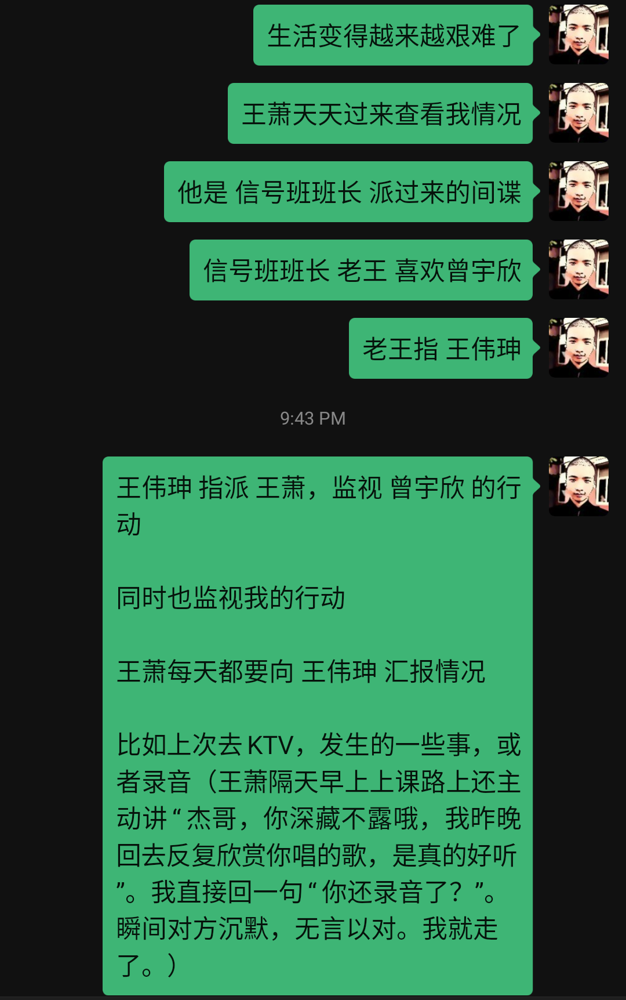

# 重庆电务段入职培训

## 基本方针

观察、思考、实践、总结。

### 观察

听人说，看人做

### 思考

他为什么要这么说？

他为什么要这么做？

背后的原理是什么？

### 实践

尝试着做一下

### 总结

什么有用？

什么没用？

## 从心碎中获取动力

痛苦就是动力。

每一次被女生拒绝或者感到自己的渺小，就是一个获得动力的机会。

### 与出租车司机的一次聊天

事实上，我擅长于与任何陌生人聊天。

并且在短时间内，别人不会对我产生任何不好的反应。

在出租车上，我认真地询问了司机关于男女朋友这件事。司机也比较大方，给了我不少建议。

其中主要提到要扩大交际圈。然后不能找烟花之地的女性。

最后，有一个比较重要的事情就是： “不能在一棵树上吊死。”

> 有些女人，被你知道了是同时找两个男性。
>
> 实际上你不知道的情况下，勾搭了多少个你根本毫无概念。

我们在谈话的过程中，也涉及了一些具体的事件，比如微信的聊天。

里面讲到不能对女生过于热情，在第一次热聊之后，应该放缓，并时不时地主动约出来看电影。如果对方拒绝，换下一个女性。

出租车司机讲得最靠谱的事情是： 作为一个男人，需要让女人感到成熟、稳重、靠谱。

这样女人才会放心把她自己交给你。

所以我就向我追求的对象讲了这么一件事：

> 不好意思，今天犯了一个严重的错误
>
> 作为一个成熟的男性，自己的事情应该自己做，同时做决定时应该更果断、更富有成效

### 学习就是我的力量

The ability of learning is my power.

I learn everything. Especially, for now, I'm engaged in learning how to be good at social.

### 聪明的女性喜欢什么样的男人

* 有钱
* 有智慧
* 成熟、稳重、靠谱

## 我与曾宇欣

我觉得这就是缘分。

谁能想到她记了我这么多年。

在参加工作的时候，在工作群组里，竟然能从名字和头像认出我是她小学一年级的同学。

而我也比较搞笑，直接在工作账号上使用真人头像和真人名字。

我们依然保持着些许的童心，我们依然保持着对未知的好奇、对知识的渴望。

### 第一次约女生吃饭

我是先就打了招呼的。

这是我原话:

> 曾宇欣，你好！
>
> 今天下午放学后，我会尝试约你一起吃饭（简易晚餐
>
> 同样的步调、同样的地点，在接近宾馆大门口的时候开始
>
> 你高兴就接受，不高兴就拒绝 （没有关系，毕竟有可能别人都看着
>
> 祝你愉快。 胡英杰 8月19日

然后嘛，倒是有点反差萌。

我说: "曾宇欣，等会儿要一起吃晚饭吗？"

曾回到: "不去"

 **好了，重要的是过程，至少我踏出了坚实的一步** 

### 规律是绝对的，是不容挑战的

我之前有讲过“沉默意味着拒绝”。

现在看来，确实如此。

这是曾宇欣给我回复的两段话：

> 谢谢你的关心，你以后能不能别给我发消息了呀，也别跟着我，我想做我自己想做得事，希望你能理解。

> 你准备再多都没得用，我对你没兴趣也没意思，求求你不要给我发信息了，你再发我就拉黑了。

### 人是善于伪装的动物

从上面两段回复，我们能大概知道，前一个是经过伪装的思想。

后一个才是她的真实意识形态。\(很俗，说实话。我不喜欢。\)

### 曾宇欣到底经历了什么

可以感觉到，曾宇欣对男人的把握，已经到了一个很高的境界。

她可以操纵喜欢她的男人为她做任何事情。

只要她保持一种纯真，一种天真无邪的感觉，男人就没有办法抵抗。就算男人想抵抗，当他看见她那经过层层修饰的精美的面容时，也会心软下来。

这就是男人的劣根性。

## 无心插柳，柳成荫

今天人生第一次主动被女生约坐车\(魏雪怡\)。（一般来讲，对方对你没有兴趣，是不会主动提出这种请求的）

今天第一次主动敲女生宿舍门\(魏雪怡\)。\(严格讲，是她一个人的宾馆单间\)

感觉还可以，单独聊了半个小时。

## 人生中最黑暗的时刻

说出来你都不会相信，但这确实在真实世界发生。

我们生活在一个充满监控的世界。不仅有统治者监控被奴役的人民，也有人与人之间发生的相互监控。

有图为证：

我其实已经受够了，要是谈恋爱需要互相这样监视对方。还不如不谈，那多自由！

我的信条是，如果对方要离开你，怎么都会离开你，你的监视不会有任何的作用。

对方离开你，只是因为你对她没有吸引力。

